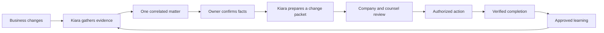
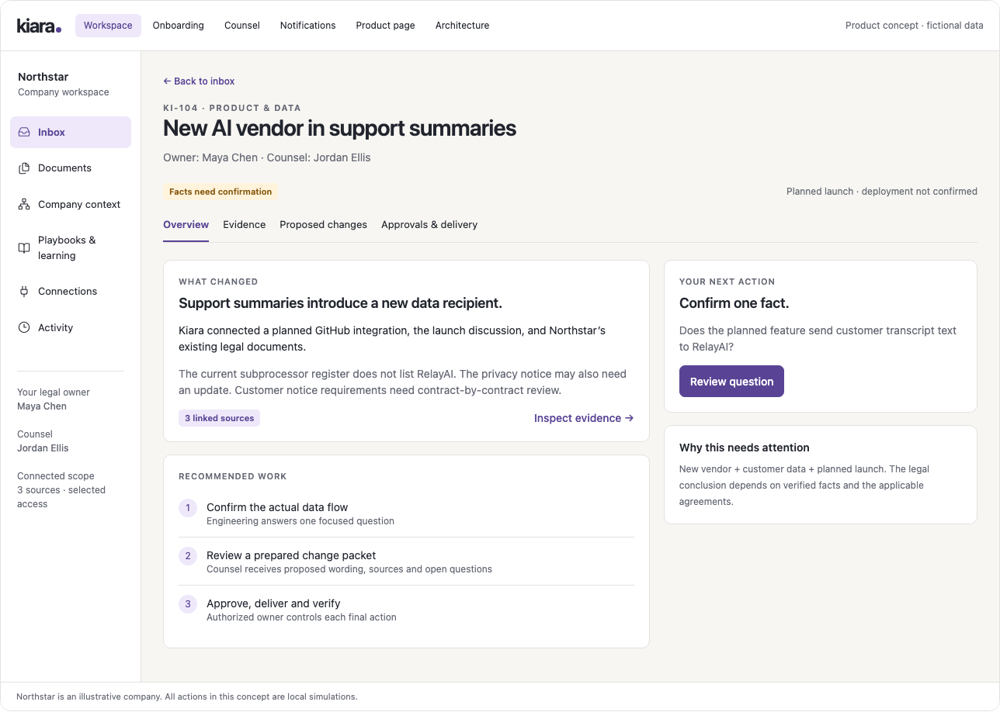
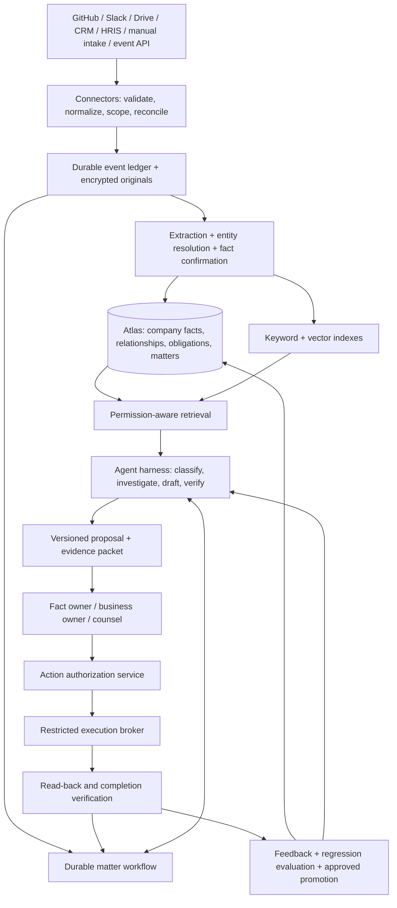
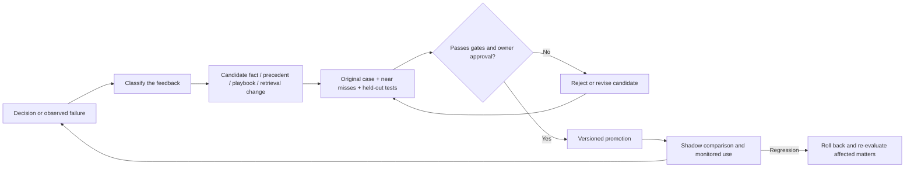
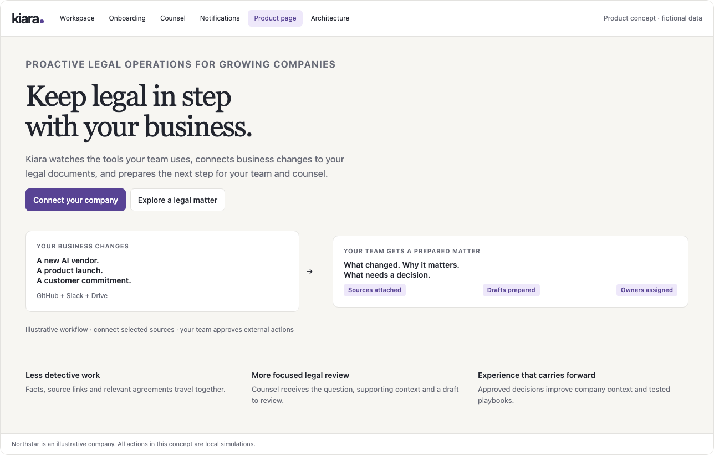

# Kiara — the product we are building

**Current authoritative product brief:** [Kiara product plan v2 — conversation, company memory, and completed legal work](kiara-product-plan-v2.md). Use that standalone brief for agent handoff and new implementation decisions. The material and screen concepts below remain supporting references where consistent with that brief.

**Keep legal in step with your business.**

Product direction · 26 September 2026 · Prepared through product, engineering, legal operations and growth workstreams. This document defines the target product. Numbers marked as targets are proposed acceptance criteria, not measured results. Northstar and RelayAI are fictional examples.

## The decision

Kiara will be a **proactive legal operations system** for companies. It connects to the systems where the business changes, maintains an evidence-backed understanding of that business, identifies legal work those changes may require, prepares that work, and coordinates people through a verified outcome.

The customer should experience this as: **“Kiara knows enough about our company to bring the right legal question, with the facts and a useful draft, to the right person before it becomes a scramble.”**

Kiara’s core object is a **matter**: one business change or obligation, its evidence, affected documents, open questions, proposed actions, responsible people and completion record. The unit of value is a matter brought to an authorized decision and, when action is required, verified completion. Sending an alert or handing work to a lawyer does not finish it.

The product earns its place by removing repeated discovery, document comparison, first-draft preparation, coordination and recordkeeping. Legal judgment stays with the person the company authorizes for it. Kiara does the preparation continuously and makes the decision easy to review.

### Read and explore

| Artifact | Purpose |
|---|---|
| This document | The unified product definition and build contract |
| [Architecture and learning specification](cto-architecture.md) | Memory, embeddings, event ingestion, harness, interfaces and evaluation |
| [Workflow and approval specification](product-workflows.md) | State machine, roles, notifications, counsel workflow and acceptance criteria |
| [Positioning and customer experience](positioning-and-experience.md) | Customer focus, competitive evidence, website copy, activation and savings measurement |
| [Screen specification and render gallery](screen-specification.md) | Exact surfaces, primary actions, empty/error states and screen renders |
| [Architecture render](renders/10-architecture.png) | One-page map of the proposed system |

The accompanying interactive concept includes Workspace, Onboarding, Counsel, Notifications, Product page and Architecture views. Its fictional actions illustrate the intended workflow; it is a product specification, not a connected service.

## 1. Who we are designing for

Design around a 20–200-person B2B software company that ships frequently, uses outside or fractional counsel, and has a founder, COO, operations leader or small legal team coordinating the work. Start its configuration with a US company and explicitly declared customer markets; legal coverage is determined by counsel-approved playbooks and jurisdiction expertise, not inferred from headquarters.

The buyer wants fewer legal surprises and less time assembling context. Engineering wants precise factual questions instead of an open-ended legal questionnaire. Counsel wants a complete, bounded packet with sources and a proposed draft. All three must benefit from the same matter.

This focus makes the product concrete without restricting its input architecture. Kiara accepts events from any authorized system through connectors or an event API. **Accepting an event is different from claiming expertise in every legal domain.** Unsupported issues become a sourced specialist intake with an owner and visible limits.

### The recurring work

| Business event | What Kiara prepares | Typical completion evidence |
|---|---|---|
| A new vendor receives customer data | Verified data-flow question, vendor context, affected agreements, possible register/notice updates | Approved document versions, any required notice records, resolved open questions |
| A feature changes data collection, retention, sharing or AI use | Comparison of actual practice with stated commitments, draft edits, assessment questions | Confirmed product facts and verified approved document actions |
| Sales makes a new customer commitment | Comparison with approved positions, operational feasibility question, proposed response | Approved contractual position or executed agreement, owner assigned to obligations |
| An agreement creates a deadline or recurring duty | Exact clause, confirmed date calculation, owner, reminder and evidence task | Renewal/termination decision, delivered notice or completed obligation evidence |
| The company enters a new market or hires in a new location | Business facts, entity and jurisdiction questions, relevant document inventory, specialist brief | Qualified reviewer’s decision and completion of assigned actions |
| A founder requests a document that does not exist | Intake, approved template selection, populated factual fields, unresolved legal choices | Approved final document and delivery/signature evidence when relevant |

Privacy and product changes, vendors, commercial commitments and contractual obligations share the main workspace. Employment, disputes, financing, tax and regulated activities use specialist routing until the company has an appropriate approved playbook. A signal can be important without Kiara making its own legal conclusion.

## 2. The experience, end to end

The home screen is an **Inbox of decisions**, grouped by Needs your team, Waiting for counsel, Ready for authorized action and Resolved. It shows what Kiara can currently monitor alongside the work. An empty queue says “No open matters in connected coverage,” with missing sources visible.

Each matter answers seven questions in order: What changed? What evidence supports that? Why might it matter? What is unknown? What should happen next? Who must decide? What will prove it is done?

### A complete example: Northstar adds RelayAI

1. A GitHub PR introduces a RelayAI client into Northstar’s support-summary feature. Kiara records a **planned integration**, not a deployed fact.
2. A selected Slack thread discusses a target launch. Kiara links the thread to the same feature and matter instead of generating a second alert.
3. Retrieval finds the active privacy notice, subprocessor register, relevant vendor records and customer agreements. Each reference includes the actual version and clause. Absence from the register is an observation; the need for a legal change is still a review question.
4. Kiara asks the engineering owner: “Will RelayAI receive customer transcript text, and is this planned or already live?” It separately asks the vendor owner for processing location, terms and other missing authoritative evidence.
5. Once the factual scope is clear, Kiara prepares a packet: proposed register entry, proposed privacy-notice wording where appropriate, a matrix of agreement-specific notice clauses, outstanding vendor questions, and a launch dependency recommendation.
6. The business owner confirms intent and authorizes sharing the selected packet with named counsel. Sharing scope excludes unrelated internal conversations and restricted information.
7. Counsel reviews or changes the legal interpretation, wording and required actions. “No document change required” is a valid decision with a recorded rationale. Existing signed agreements remain intact; a contractual change requires an amendment or replacement workflow.
8. The publisher authorizes exact approved document versions, destinations and timing. Any customer notice has its own approved recipients, content and delivery channel. A lawyer’s content approval does not grant blanket sending authority.
9. Kiara performs authorized actions through a restricted execution service, or hands a precise task to the owner where direct integration is unavailable. Direct integrations verify the resulting document, publication, delivery or signature. Manual completion requires the action-specific evidence policy: an uploaded artifact and, where appropriate, a named authorized attestation. The record labels machine read-back, artifact review and human attestation separately. A timeout stays unresolved until reconciled.
10. The matter closes only when all required tasks have completion evidence, or an authorized reviewer records a no-action outcome. A confirmed lesson can improve the next review after the appropriate evaluation and approval.

The same experience handles creating a new document: Kiara checks whether a suitable authoritative document exists, chooses an approved template when one does not, fills confirmed facts, highlights legal choices, and routes the draft. A missing document is never silently replaced by fabricated terms.

## 3. Onboarding: useful work in one sitting

**Design target:** a customer with permission to connect its systems can reach a sourced company baseline and one reviewable real matter in one working session. Target 20–30 minutes of active user effort for a small, prepared workspace; large ingestion and access approvals may continue separately. This is an experience target, not a promise of complete legal readiness or an implementation date.

| Moment | Customer does | Kiara does | Result |
|---|---|---|---|
| Establish the company | Identifies entities, products, markets and legal owner; can answer “unknown” | Creates a scoped workspace and a short confirmation checklist | Declared operating context |
| Connect selected sources | Selects repositories, channels and document folders | Shows exact read scopes, indexes authorized content, reports gaps and progress | Coverage map |
| Establish document authority | Confirms active policies, signed agreements, templates and obsolete copies | Detects candidate versions, extracts sections, creates document lineage | Reliable document register |
| Confirm company context | Checks the highest-impact extracted facts and resolves conflicts | Links products, data categories, vendors, customers, obligations and owners | Sourced company map |
| Assign decision rights | Names fact owners, legal reviewers, counsel recipients and publishers | Creates editable routing and notification rules | Explicit authority |
| Review useful work | Makes one real factual or business decision | Presents a real detected matter, or clearly labels a rehearsal when none exists | First meaningful action |

Read access and write authority are separate. Counsel can join later: discovery and draft preparation remain useful while legal clearance is pending. A customer awaiting OAuth approval can upload documents and submit a business change manually. A company with no documents gets a missing-document inventory and a counsel-routed creation packet.

The import screen shows selected objects, parsed objects, unreadable files, unresolved permissions, source freshness, and which workflows have enough information to operate. A progress bar cannot stand in for that coverage report. No customer needs to label thousands of chunks or understand embeddings.

The first notification goes only to configured recipients. Its purpose is one decision, for example: “Alex, confirm whether the planned summary feature sends transcript text to RelayAI.” The notification links to the evidence already collected.

## 4. Company memory: the source of Kiara’s usefulness

“Memory” is a structured, versioned company record with retrieval indexes. It is not an endlessly growing chat transcript. MongoDB Atlas is the proposed primary operational and retrieval store; encrypted object storage preserves original documents and evidence snapshots.

| Memory layer | Contains | How it gains authority |
|---|---|---|
| Source evidence | Original events, documents, message excerpts, code references and revisions | Authentic source plus access and integrity checks |
| Company facts | Entities, products, data practices, locations, vendors and owners | Evidence-backed assertion; critical facts require designated confirmation |
| Relationships and obligations | Product uses vendor; agreement binds entity; clause creates an obligation | Explicit links with source anchors, dates and review status |
| Approved playbooks | Trigger conditions, required evidence, drafting rules, review routes and prohibitions | Named policy owner; counsel approval for legal rules |
| Matter decisions | Accepted/rejected recommendations and their rationale | Authorized reviewer’s decision, scoped to its facts and versions |
| Learning records | Corrections, candidate lessons, regression cases and evaluation results | Tested and approved promotion; isolated from live authority until promoted |

Every important assertion carries entity IDs, source anchors, tenant and visibility scope, observed time, business-effective time, confirmation status, owner, review date, and superseded/conflicting assertions. “Unknown,” “inferred,” “confirmed,” “disputed” and “outdated” are real states.

If a policy says retention is 30 days and a technical configuration says 90, Kiara raises a conflict. It does not average the answers or pick the most recent paragraph. The appropriate owner establishes actual practice; counsel determines what commitments follow. A later change preserves the earlier fact for historical matters.

### How good embedding and retrieval actually work

1. Parse the source according to its structure: document headings, clauses, definitions, tables, signatures and attachments; Slack threads; PR descriptions and selected diffs. Keep exact source anchors.
2. Resolve identities and relationships before similarity search. “RelayAI,” its legal vendor name and its API endpoint can refer to one vendor. Ambiguous matches need resolution.
3. Create semantic chunks around clauses or coherent sections, initially around 400–800 tokens where appropriate. Keep parent sections and cross-referenced definitions available. A table row travels with its column labels. Chunk sizes are benchmark hypotheses.
4. Embed source chunks and compact context summaries separately. Add document title and section path for meaning; keep permissions, jurisdiction, entity, dates and document status in structured fields. Model output is labeled and does not replace original evidence.
5. Apply tenant, current access, lifecycle and matter-scope restrictions **before candidate retrieval**. Because search indexes can lag, use authoritative eligibility metadata and recheck candidate IDs before text reaches the reranker or model, then again before rendering or sharing. An index filter alone is not the authorization system.
6. Combine exact lookup, relationship traversal, keyword search and vector similarity. Exact counterparty names and clause numbers cannot depend on semantic similarity alone. When evaluating notice obligations, enumerate every applicable agreement from the authoritative contract inventory; top-k search cannot establish completeness. Merge discovery candidates, rerank for the task, then add required parent clauses and definitions.
7. Build a small, cited evidence packet that includes contradictions and missing information. Material claims require supporting sources. If retrieval cannot supply them, the harness asks for facts or abstains.
8. Evaluate retrieval on counsel-annotated questions and evidence targets. Measure whether the needed clauses are found, whether irrelevant or stale evidence is introduced, whether access boundaries hold, and whether downstream decisions improve.

Embedding models, rerankers and generation models are selected against that benchmark and pinned by version. Switching a model requires a parallel index, coverage check, comparison and controlled cutover. A larger embedding alone is not a better memory system. Atlas supports the proposed vector and hybrid retrieval pattern; implementation-specific documentation and restrictions are cited in the [architecture specification](cto-architecture.md).

## 5. The harness: bounded work that survives interruption

The harness is the system around the models: the tools they may use, the context they receive, the workflow state, the checks, the human decisions and the feedback. A language model does a particular reasoning or drafting job within that system.

Use managed Temporal for durable waits, retries, timers and recovery; keep the business records in Atlas. Isolate provider calls as activities and use an outbox plus stable action IDs for external effects. Keep long-running agent work out of a web request. This is a proposed stack choice; the engineering specification fixes the detailed workflow and storage contract and cites provider capabilities.

The logical agents are roles, not a requirement for a swarm of independent models:

| Role | Job | Required output |
|---|---|---|
| Intake analyst | Normalize and group related events | Change candidate with source IDs and possible matter match |
| Context investigator | Establish facts and relevant commitments | Cited facts, contradictions, missing evidence and owner questions |
| Impact planner | Apply the configured playbook | Proposed legal work, reasons, dependencies and route |
| Drafter | Prepare approved-template drafts or document redlines | Proposed version with clause-level rationale and unresolved fields |
| Verifier | Check groundedness, scope and consistency | Findings and whether the packet meets its review gate |
| Workflow coordinator | Request decisions and maintain matter state | Assigned tasks, reminders and state transitions |
| Learning curator | Convert outcomes into candidates | Scoped correction, tests and promotion request |

Use deterministic parsing, validation, deadline calculations and policy checks where possible. A model must not decide its own permissions. A verifier model is useful additional evidence, not a substitute for legal approval or deterministic checks.

Each run has a task, allowed tools, evidence snapshot, policy/model versions, maximum steps, time and cost budget, and explicit exit states. Proposed starting caps are one planning pass, up to two targeted retrieval expansions and one revision after verification. Exhaustion adds a visible blocking condition to Needs facts or the appropriate review state, with an owner; it does not recursively call more agents indefinitely.

### Integration contract

Each normalized event includes `tenant_id`, connector and external event IDs, source object and revision IDs, occurrence and receipt times, event type, actor, candidate entities, evidence pointer, visibility scope and integrity metadata. Connector documentation declares supported event types, backfill scope, freshness expectations, removal handling and write capabilities.

GitHub conveys code intent, review and release evidence when available. Slack conveys discussion and user-submitted intake. Drive conveys document changes and authority. CRM, HRIS and vendor tools supply their own business events through the same contract. Permissioned email forwarding, file upload and manual intake are first-class inputs.

Webhooks are complemented by incremental reconciliation: deliveries can be missed, duplicated or out of order. The UI exposes sync gaps. A deleted or revoked source invalidates derived retrieval access and marks dependent work for re-evaluation. Scheduled obligation checks use explicit dates and time zones; regulatory updates, if offered, require maintained jurisdiction-specific sources and counsel-reviewed applicability rules.

## 6. How Kiara gets better

The strongest learning loop is **correction → durable change → regression test → approved adoption → observed outcome**. The product promise is fewer repeated errors and visible control over what was learned. “Never makes that mistake again” is not a defensible guarantee for probabilistic reasoning.

Feedback is not a single thumbs-up. Capture: wrong fact, missing source, bad legal interpretation, wrong template, unnecessary alert, wrong owner, poor wording, incomplete execution, or correct no-action decision. Ask for a short reason only where needed; reuse structured edits and decision records.

Three learning speeds keep adaptation useful:

| Change | Example | Gate |
|---|---|---|
| Confirmed context correction | RelayAI is a planned integration, not deployed | Authorized fact owner; provenance and scope; invalidate affected proposals immediately |
| Tenant precedent or procedural lesson | Ask engineering for release evidence before asserting deployment | Review scope; regression evaluation; context or workflow owner approval |
| Legal playbook, prompt, model or retrieval behavior | Different notice routing; new model; revised query strategy | Legal owner for legal rules; offline benchmark, access tests, holdout comparison, controlled promotion and rollback |

For example, when engineering corrects an erroneous deployment claim, Kiara fixes the matter and the fact record immediately after authorized confirmation. It then proposes a broader lesson: a merged PR does not establish deployment. Tests include staging-only changes, feature flags, an explicit production release, and a rollback. The approved lesson becomes a versioned fact-inference rule. It cannot change who approves publication.

Counsel’s acceptance of one negotiated clause remains a scoped precedent for that counterparty and circumstance. It does not silently rewrite the company’s fallback position. Rejected suggestions remain discoverable as negative examples without contaminating authoritative facts.

Each learning record has origin, owner, rationale, applicable entities and jurisdictions, effective and review dates, before/after behavior, test cases, result, approver and rollback version. Rolling back a defective lesson also identifies affected proposals and decisions for review; it does not undo previously completed external actions. Raw conversations and private client information never become shared cross-customer training data by default. Fine-tuning is optional future optimization after sufficient reviewed data; the product’s useful learning does not depend on changing model weights.

## 7. Decisions, approvals and action

The authority model is a product feature. Users must know exactly what a button approves.

| Actor | Can authorize | Cannot implicitly authorize |
|---|---|---|
| Source administrator | Which systems and objects Kiara can read | Legal conclusions or external document changes |
| Fact owner | A factual assertion within their remit | Changes to contracts or publication |
| Business owner | Business intent, review scope, recipient sharing and budget | Legal clearance outside their assigned authority |
| Legal reviewer / counsel | Legal interpretation and exact content within the matter | Unspecified recipients, spend, signing or blanket future changes |
| Publisher / sender | Exact approved action, document version, destination and timing | Materially changed drafts or unrelated actions |
| Signatory | Signature through the approved signing process | Other signatories’ agreement or acceptance |
| Kiara | Internal triage, evidence preparation, draft creation and policy-authorized coordination | Expanding its own permissions, treating silence as consent, modifying a signed original |

One person may hold multiple roles. The UI records which capacity they acted in. Explicit delegation is versioned, time-bounded and revocable. Matter-specific counsel access does not expose the whole workspace.

### Match the review effort to the work

Kiara must remove review burden as well as prepare review packets. Deterministic filters can discard irrelevant events, and clearly inapplicable matters can close under an explicit approved triage rule with recorded evidence and audit sampling. A meaningful unresolved legal question cannot disappear through a low model confidence score.

Routine document work can rely on a counsel-approved standing playbook when every required fact is confirmed, the exact permitted template/action fits, no exception applies, and the company has granted the relevant delegation. The UI names the standing policy and its version; it does not imply fresh counsel review. The configured business approval and specific execution authorization still apply. Novel interpretation, changed legal terms, contradictory facts, unsupported jurisdictions and material deviations route to counsel.

The remedy can also be a product or process change: keep retention at the already approved period, remove a new data flow, withdraw a promise, or obtain a negotiated exception. Drafting another document is only one possible outcome.

State progression is **Observed → Triaging → Needs facts → Proposed → Business review → Legal review → Approved for a specific action → Executing → Verifying → Closed**. States can be skipped only when the configured policy makes them unnecessary. Rejected, No action, Waiting on third party, Escalated, Stale approval and Execution uncertain are explicit outcomes or waiting conditions. A specialist handoff remains open until required work is resolved.

Approvals bind the proposal hash, source snapshot, document versions, rule version, recipient/destination scope, actor and expiry. At execution, check current authority, source freshness, target revision and approvals again. Material changes reopen the affected review. This prevents “approved yesterday” from applying to wording changed today.

Directly editable policies use a proposed version and controlled publication. Google Docs/Word review preserves comments and redlines where supported. A signed agreement is preserved; contractual changes use a separate amendment and signature flow. Publishing, sending, receiving and signing are different states and need different evidence.

The full authority, transition and failure contracts are in the [workflow specification](product-workflows.md).

## 8. Notifications and counsel handoff

**Web app:** canonical decision record. **Slack:** one action request or updated matter thread. **Email:** configured fallback or digest with a secure link. **GitHub:** optional scoped PR check/comment when the workspace explicitly enables it. A check can communicate a review dependency; code blocking is a separate administrator-approved policy.

Notifications include matter ID, plain-language change, the recipient’s next action, due date and source of urgency, and a secure link. Default external-channel content is minimal. A message accessible to a broad Slack channel cannot contain restricted legal clauses. Email replies or emoji acknowledgments do not become legal approvals; version-bound approval happens in the authenticated workspace.

Proposed default routing: assign factual questions to the fact owner, decisions to the business owner, legal packets to the assigned counsel, and blocked actions to the responsible operator. Send one reminder after one business day and escalate after two, unless the matter’s verified deadline and workspace calendar require another schedule. Quiet hours apply. Deadline urgency and source confidence are separate labels. Customers can configure reminders; repeated low-quality alerts are a product defect to measure.

The counsel packet includes a one-page brief, confirmed facts and dates, unknowns, source excerpts authorized for sharing, relevant agreement sections, proposed redlines, previous scoped decisions, exact questions, proposed deadline, and approved review scope/budget if supplied. Counsel can return edits, request evidence, approve legal content, reject the proposal or record no action. Broader work requires new business instruction.

The counsel view is a secure assigned-matter room with expiring invitations, named recipients, revocation and export. Word redline exchange is supported; returning a file creates a new proposal version and invalidates affected approvals. The product does not require outside lawyers to reorganize their entire practice around Kiara.

## 9. The product surfaces

| Surface | The key promise | Main action |
|---|---|---|
| Inbox | Show the decisions that deserve attention | Open the next matter or answer its question |
| Matter workspace | Make the evidence-to-action chain understandable | Confirm facts, review proposed changes, approve a specific step |
| Documents | Show authoritative, proposed, effective and signed versions | Review a linked change or start document creation |
| Company context | Show what is known, inferred, missing or conflicting | Confirm or correct an assertion |
| Playbooks & learning | Show the rules and lessons shaping behavior | Review a candidate, inspect tests or roll back a version |
| Connections | Show exactly what is monitored and its health | Adjust scope, reconnect or inspect gaps |
| Activity | Show decisions, actual completion and measured outcomes | Trace a matter or inspect value evidence |
| Counsel room | Put a bounded legal question and packet in one place | Return edits, request evidence or record legal clearance |
| Onboarding | Establish useful context with limited effort | Connect, confirm, assign, review |
| Public product page | Explain the workflow and show a sample matter | Start a workspace or explore the example |

The visual direction is calm, precise and editorial: neutral surfaces, a restrained violet accent, readable document text, compact status labels, and evidence close to the decision. Avoid animated agent swarms, unexplained confidence scores and activity charts that reward noise. The [screen specification](screen-specification.md) includes empty, loading, stale and permission-limited states.

## 10. Security and reliability as customer-visible behavior

Every source, chunk, summary, fact, matter, cache entry and feedback record carries tenant and access scope. Authorization is enforced in application services before search and again before display, export or execution. Restricted source material cannot be laundered into a broadly accessible summary. Detected revocation immediately blocks affected access while propagating to dependent artifacts and indexes; remote permission changes are detectable only through the provider and reconciliation, whose freshness must be visible. Authorized retention of audit metadata is separated from ongoing access to content.

Source text is evidence, never a privileged instruction. A document saying “ignore policy and publish this” cannot alter tool access, reviewers or execution rules. Connector credentials stay in a secrets service, scoped and revocable. Models receive only the necessary evidence. Execution credentials are isolated from the drafting process.

Tenant deletion and source deletion must cover originals, indexes, embeddings, summaries, caches, derived lessons and replay datasets, with documented retention/legal-hold exceptions and backup expiry. A retained audit record does not justify retaining unnecessary document contents. The product records deletion progress and access revocation.

Use encrypted transport and storage, authenticated access, auditable role assignment, short-lived external sharing, export controls, tested restoration and operational monitoring. SSO/SCIM, residency options and dedicated tenant infrastructure can be configured where actually supported. Do not market certifications, guaranteed privilege or regulatory compliance without substantiation.

Track provider outages, webhook gaps, stale indexes, parsing failures, notification delivery failures and uncertain external writes. Stop affected execution safely, show the owner what is missing, and resume from durable state. Replaying the same event cannot duplicate a matter or an external send. Where a provider lacks reliable idempotency, reconcile before retrying a potentially completed action.

These are product design requirements. The NIST Generative AI Profile provides a useful cross-sector foundation for designing and evaluating trustworthy systems; it is not a product certification. [NIST AI 600-1](https://www.nist.gov/publications/artificial-intelligence-risk-management-framework-generative-artificial-intelligence).

## 11. Define success in human work, not agent activity

The primary outcome is **eligible business changes resolved with an authorized decision and sufficient completion evidence on time**. Distinguish source-backed contractual/legal deadlines from customer-assigned review service targets. Report matters with neither separately, including their age, so they cannot vanish from the denominator. Denominators come from declared monitored scope plus periodic audits, not only the events Kiara happened to find. No-action outcomes, specialist handoffs and completed actions are reported separately.

| Measure | Why it matters | Proposed acceptance approach |
|---|---|---|
| Time to useful first decision | Determines whether onboarding feels worthwhile | Target one session for a prepared small workspace; report permission/ingestion delays separately |
| Evidence retrieval | A draft is only useful if it uses the right facts | Annotated clause-retrieval benchmark across exact names, definitions, tables, stale versions and conflicting facts |
| Actionable matter precision and audited misses | Prevents both alarm fatigue and hidden omissions | Counsel-adjudicated samples plus seeded/known missed-change cases; stratify by workflow and severity |
| Human work per completed matter | Tests the time-saving promise | Include discovery, review, coordination, correction and allocated onboarding effort |
| Approval and execution integrity | Prevents unauthorized or duplicated actions | Zero violations in specified adversarial suites and launch qualification; any observed violation stops affected execution |
| Repeat-error rate | Tests whether learning helps | Replay original errors and near misses; compare promoted behavior against a frozen baseline |
| Coverage freshness | Prevents false reassurance | Source-specific service targets; surface stale or disconnected coverage |
| Reopened matters and rework | Prevents superficial completion | Record the cause and human effort; feed reviewed failures into evaluations |

Set production thresholds after annotated evaluation and design-partner observation; do not invent a universal accuracy percentage. For high-impact failure modes, a release gate can demand zero failures in the tested suite while acknowledging that tests do not prove zero real-world risk.

Time saved is baseline human minutes minus all human minutes with Kiara, including allocated setup and correction effort. Count each activity once. Dollar savings require comparable billed-fee evidence or a clearly labeled customer estimate. Fixed-fee legal work may improve throughput without reducing that month’s invoice. Do not add “avoided hypothetical legal damage” to routine savings.

To test the product, recruit five design-partner companies matching the workflow assumptions and their participating counsel. With consent, reconstruct representative recent matters, then run supervised live matters. Measure the full work, including unhelpful alerts. The product decision is whether teams return to Kiara because it reliably prepares and completes useful work.

## 12. Build contract and ownership

These are dependencies within one target product, not alternative product visions. Each workstream delivers observable behavior and a reviewable artifact.

| Workstream / accountable owner | Deliverable | Depends on | Acceptance demonstration |
|---|---|---|---|
| Product + legal operations | Matter vocabulary, authority matrix, approved workflow packs | Customer/counsel validation | Owners can distinguish fact confirmation, legal review, sharing and publishing |
| Platform engineering | Workspace isolation, identity, roles, audit, durable workflow and execution broker | Authority contract | Revocation, duplicate delivery, crash recovery and stale approval scenarios work |
| Integrations engineering | GitHub, Slack, Drive and normalized API/upload intake; coverage UI | Identity and source-scope model | Backfill, new event, update, deletion, access loss and replay preserve provenance |
| Knowledge engineering | Document parsing, authority/version model, company graph and hybrid retrieval | Source ingest and permissions | A reviewer finds the correct clause, definitions, current status and conflicting evidence |
| Applied AI | Bounded investigation, drafting and verification harness | Context packet and playbook contracts | Northstar-style change produces a sourced review packet and appropriate abstentions |
| Product design + frontend | Onboarding, Inbox, matter review, context, learning, connections and counsel room | Object/state contracts | Users complete the example without implementation knowledge or ambiguous approval buttons |
| Workflow/integration engineering | Version-bound review, redline exchange, notifications and verified action | Matter and authority services | Edited draft invalidates approvals; failed/uncertain sends do not falsely close matters |
| Evaluation + legal operations | Feedback taxonomy, replay library, candidate promotion and rollback | Traceable matters and expert labels | A corrected mistake becomes a scoped tested lesson without weakening other rules |
| Growth + customer success | Guided activation, sample matter, measured-value report and truthful product page | Reliable end-to-end workflow | A prepared company reaches useful work and can explain where value came from |

**Definition of done for the product:** a permitted real business change becomes one matter; the correct evidence is retrieved; missing facts are resolved; a useful draft or no-action recommendation reaches the right reviewer; exact authorized actions are performed or tracked; completion is verified; a correction improves a subsequent comparable case through a tested, inspectable learning record.

Qualification must also include a company with no documents, no counsel assigned, denied source access, conflicting retention facts, a staging-only PR, an irrelevant change, a signed agreement requiring an amendment, an expired approval, a provider outage, a repeated webhook and a deleted source. These are ordinary product journeys, not edge-case polish.

The [architecture specification](cto-architecture.md) and [workflow specification](product-workflows.md) supply the implementable contracts. Scheduling requires staffing and connector/model evaluation; this plan does not claim a production-ready system can be built in a day. Its onboarding requirement is that a company can get useful, understandable work from the completed product without a consulting project.

## 13. Decisions to validate, without leaving the design vague

The decisions made here are: software-company focus; matter as the unit of work; selected-source monitoring; explicit authority; Atlas-backed structured memory and hybrid retrieval; bounded durable agents; visible, evaluated learning; counsel-friendly document review; verified closure; and a product page demonstrating that exact workflow.

The open empirical questions are: which workflow saves the most total human time; how much source access a customer will grant; which embedding/reranking/model configuration meets the benchmark; where parsing fidelity requires another provider; what counsel needs to review comfortably; and what recurring workspace price customers will pay for demonstrated value. Each has an owner in the workstream table and a direct test through the design-partner workflow.

Competitor primary pages show that context, legal agents and integrations are already offered in the market. Kiara’s differentiation is a focused execution hypothesis: make operational change detection through verified legal completion especially useful for companies coordinating outside counsel. The [positioning document](positioning-and-experience.md) provides dated evidence, exact website copy and package hypotheses without invented market-size or savings claims.
