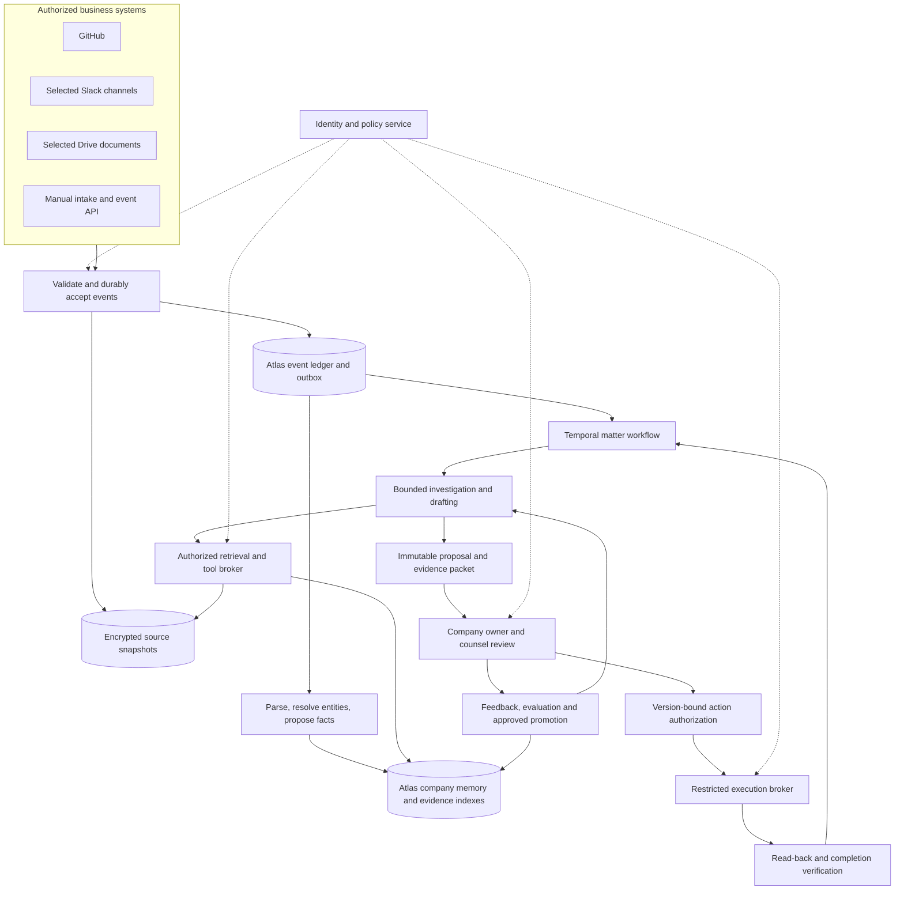
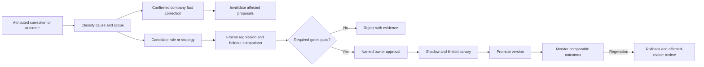

# Kiara architecture and learning specification

**Target product · 26 September 2026.** This specification makes the [product plan](README.md) implementable. Northstar and RelayAI are fictional. All performance numbers below are initial design targets or evaluation hypotheses, not measured results. Sources were accessed on 26 September 2026, America/New_York.

## 1. The engineering decision

Build Kiara as a permission-aware company memory connected to durable **matters**. Models investigate and draft inside that system. They do not own company truth, approval authority or external actions.

Use a TypeScript web application and API, managed Temporal for durable orchestration, MongoDB Atlas for operational records and hybrid retrieval, encrypted object storage for originals, and a restricted connector execution broker. Run API, connector/knowledge workers, workflow workers and evaluation workers as separately scalable processes from one modular codebase. These are a few deployment boundaries, not a microservice for every agent.

| Component | Decision and purpose |
|---|---|
| Browser application | Onboarding, Inbox, Matter, Documents, Company context, Playbooks & learning, Connections and restricted counsel room |
| API and policy service | Authenticate people; authorize every operation; accept versioned commands; serve permission-filtered views |
| Managed Temporal | One workflow per matter; human waits, deadlines, retries, cancellation and crash recovery; ingestion/reconciliation workflows per connection |
| MongoDB Atlas | Facts, relationships, obligations, revisions, matters, decisions, outbox, audit references; Search and Vector Search over authorized evidence |
| Encrypted object storage | Original bytes, parsed renditions and review packets with hashes, retention policies and restricted download tokens |
| Tool broker | Schema-validated reads and separately authorized writes; credentials never enter model prompts |
| Model gateway | Version-pinned extraction, drafting, verification, embeddings and reranking; budgets and restricted provider egress |
| Evaluation pipeline | Frozen datasets, candidate runs, reviewer adjudication, promotion registry and rollback |

Temporal is the recommended orchestrator because matters can wait days for counsel and then resume from the correct step. Its documentation explicitly supports durable human-approval patterns. That durability does not make third-party writes exactly-once: Kiara still needs action IDs, idempotent activities and reconciliation. [Temporal durable AI](https://docs.temporal.io/ai).

Choose embedding, reranking and generation providers against Kiara's annotated task benchmark, data-processing requirements and total cost per completed matter. Pin a winning configuration by version. Model selection is an evaluation decision; the architecture must not depend on whichever model currently leads a general benchmark.



## 2. Onboarding creates useful memory

The customer chooses entities, products, operating markets, source objects and owners. Read consent is separate from writing or sharing consent. Connections show exact scope and coverage, including inaccessible or unreadable objects. Upload and manual intake remain available while administrator approval is pending.

An onboarding workflow inventories authorized sources, captures originals, parses structure, resolves document lineage and proposes a company map. It prioritizes questions that unlock actual work: which agreement is signed; which policy is effective; which team owns deployment; what customer data a vendor will receive. The user confirms a concise checklist, not thousands of extracted fragments.

Document authority is explicit: draft, executed, effective, superseded, template or unknown. File modification time is not legal effective time. An unsigned copy with a recent timestamp cannot replace an executed agreement. A missing document creates an inventory gap and possible creation task, not fabricated terms.

For Northstar, connect the support-summary repository, selected launch channels and the folder containing the privacy notice, DPA and subprocessor register. Establish the RelayAI vendor entity, support-summary feature, relevant customer agreements and assigned engineering, operations and legal owners. The PR supplies evidence of planned implementation. Deployment requires separate evidence or designated owner confirmation.

The onboarding completion view states: sources synchronized, documents whose authority is confirmed, unresolved facts, supported playbooks and next useful decision. Background indexing can continue without implying that every workflow is ready.

## 3. Memory is six different things

Atlas stores typed records and explicit relationships; embeddings are retrieval indexes over selected text. There is no need for a separate graph database unless measured traversal requirements justify one.

| Collection family | Essential fields and semantics |
|---|---|
| `connections`, `source_objects`, `source_versions` | Tenant, connector installation, external ID, revision, ACL revision, lifecycle, source URL, hash, object-store pointer, freshness and parser version |
| `entities`, `fact_assertions`, `relationships` | Stable IDs, aliases, subject/predicate/value, evidence anchors, confirmation state, owner, valid interval, observed interval, supersession and conflicts |
| `documents`, `document_versions`, `evidence_chunks` | Document lineage, authority status, parties, dates, parent section, exact clause anchors, defined-term links, visibility, embedding version |
| `obligations`, `playbook_versions` | Trigger, exact source clause, applicability, jurisdiction, accountable owner, calculation rule, deadlines, required evidence and approved route |
| `matters`, `proposals`, `decisions`, `actions` | Correlated event IDs, fact/evidence snapshot, proposal hash, dependency versions, review authority, intended effect, completion evidence |
| `feedback`, `learning_candidates`, `eval_runs` | Error type, scope, origin, candidate change, permitted dataset, result, approver, deployment version and rollback target |

Every collection has `tenant_id`; every content-bearing record carries access scope and lineage. Unique indexes include tenant plus source identity/revision or command/event idempotency key. Versioned writes use compare-and-set so concurrent reviews cannot silently overwrite each other.

**Source evidence** records what a system said. **Facts** record what is asserted about the business. **Approved playbooks** define authorized behavior. **Previous decisions** are scoped precedent. **Evaluation data** tests behavior. None becomes another merely because it appears in retrieval results.

Facts have two time axes: when the business assertion applies and when Kiara learned it. “RelayAI receives production transcripts from October 3” can be observed on October 5. A historical review must reconstruct both the actual effective period and information available at decision time. States include inferred, unknown, confirmed, disputed and outdated. Conflicting retention values remain separate assertions until the designated owner resolves them.

An evidence anchor identifies the immutable version plus a resolvable location: clause/paragraph ID, page and bounding box, Slack message/thread identifier, or Git commit/path/line range. Parser offsets alone are insufficient when a document changes. Generated summaries retain links to all material supporting sources and inherit their access restrictions.

### Illustrative fact contract

```json
{
  "tenant_id": "northstar",
  "assertion_id": "fact_218",
  "subject_id": "feature_support_summary",
  "predicate": "planned_vendor",
  "value": {"entity_id": "vendor_relayai"},
  "status": "inferred",
  "valid_from": null,
  "observed_at": "2026-09-26T14:05:00Z",
  "evidence": [{"source_version_id": "pr_218_sha_a", "anchor": "diff:client.ts:12"}],
  "owner_role": "engineering_owner",
  "visibility_scope_id": "scope_product_legal",
  "supersedes": null
}
```

## 4. Retrieval that understands commitments

Parse legal documents along sections, clauses, definitions, schedules, tables and signatures. Parse Slack as bounded threads with speaker/time context; parse PRs as description plus selected diffs and lifecycle events. Preserve originals separately. Begin chunk experiments around 400–800 tokens, split only at sensible boundaries, and preserve a parent section. Table rows retain headers; cross-references retain destination links. These sizes must earn their place in evaluation.

Embed evidence chunks and compact company summaries separately. Include title and section path in embedding text; keep tenant, access, entity, jurisdiction, dates, authority and source type in filterable fields. Record embedding model, dimensions, input hash and transformation version. A summary is a navigation aid, never a substitute for the actual contract clause.

The retrieval pipeline is:

1. Resolve the authorized actor, purpose and matter scope against current policy. Build the eligible source/version set and required exclusions from authoritative metadata.
2. Resolve exact entities and relationships: RelayAI aliases → vendor; feature → product → customers; customer → executed DPA and amendments. Ambiguous matches remain unresolved.
3. Fetch known document IDs, exact clauses and defined terms. Enumerate all in-scope agreements when producing a notice matrix; a top-k search cannot prove the inventory is complete.
4. Run keyword and vector retrieval with tenant/access/lifecycle restrictions **inside both candidate searches**. Fuse rankings, then authorize candidate IDs again before text reaches a reranker or model.
5. Rerank by relevance to the precise task. Expand required definitions, exceptions, schedules and parent clauses under the same access policy. Include contradictory evidence and applicable earlier versions.
6. Return a bounded evidence packet with source anchors, document status, supported claims and missing information. Material gaps trigger questions or specialist routing.

Atlas supports vector prefilters on indexed fields. Start ANN tuning with MongoDB's documented recommendation of `numCandidates` at least 20 times `limit`, then benchmark recall and latency; that setting is not a correctness guarantee. [Vector Search query documentation](https://www.mongodb.com/docs/atlas/atlas-vector-search/vector-search-stage/?deployment-type=self&embedding=auto&interface=driver&language=java-sync).

Use explicit embeddings and index versioning for reproducibility. Use `$rankFusion` when supported by the selected Atlas version and query shape; it merges rankings within a single collection. Separate collections can use application-level reciprocal-rank fusion after each authorized query. [MongoDB rank fusion](https://www.mongodb.com/docs/manual/reference/operator/aggregation/rankfusion/).

Search indexes are eventually consistent. Therefore neither current ACL nor current document authority comes solely from search-index fields. Maintain an authoritative eligibility/deny layer and recheck returned IDs. On a detected revocation, synchronously deny affected content, invalidate caches and derived artifacts, then update indexes. When current eligibility cannot be established, fail closed for that source. Remote changes cannot be acted on before detection; Connections must display reconciliation freshness. [MongoDB index consistency](https://www.mongodb.com/docs/atlas/atlas-search/manage-indexes/?deployment-type=atlas&interface=driver&language=java-sync).

Northstar's retrieval result should include the actual notice provisions and their exceptions for each relevant customer, not just a generic paragraph about subprocessors. It must distinguish contractual obligations from public-law authority and approved company preferences. Legal-source records carry jurisdiction, effective dates, official provenance and a named review/freshness policy. Unsupported or stale legal coverage becomes a visible limitation.

Evaluation measures required-clause recall, ranking quality, definition/exception coverage, stale-evidence rate, cited-claim support and permission violations. Include exact names, amended agreements, tables, conflicting facts and irrelevant near-matches. Compare ANN with exact nearest-neighbor results to diagnose index recall, but use expert-labeled evidence to judge task relevance. Change embedding models through parallel indexes, complete backfill, benchmark, controlled cutover and rollback.

## 5. Events become one matter

The connector envelope contains tenant, installation, provider event ID, source object/revision, occurred/received times, event type, actor, candidate entities, visibility, integrity checks and evidence pointer. The authenticated installation determines tenant; a payload cannot self-select another tenant.

Validate delivery authenticity; durably write the event and outbox entry in one Atlas transaction; then acknowledge promptly. An outbox dispatcher starts or signals Temporal using stable IDs. Duplicate delivery is harmless. Outbox dispatch can repeat after a crash; workflow consumption and every resulting command deduplicate. Do not claim an atomic transaction across Atlas and Temporal.

| Connector | Contract and product implication |
|---|---|
| GitHub | Validate webhook secret, use delivery ID, check event/action, acknowledge within the provider window and reconcile missed events. PR merge, release and deployment are distinct evidence. [GitHub webhook guidance](https://docs.github.com/en/webhooks/using-webhooks/best-practices-for-using-webhooks) |
| Slack | Subscribe only to granted scope and selected channels; deduplicate event IDs and tolerate retries. Acknowledge within three seconds; defer investigation to workers. Rate limits and missed history create visible coverage gaps. [Slack Events API](https://docs.slack.dev/apis/events-api/) |
| Drive | Treat push as a wake-up to read changes, not the changed document itself. Persist change cursors and renew expiring watch channels with overlap. Reconcile permissions, deletions and document revisions. [Drive push](https://developers.google.com/workspace/drive/api/guides/push), [change retrieval](https://developers.google.com/workspace/drive/api/guides/manage-changes) |
| Other systems | Require the same envelope, source authentication, revision semantics, reconciliation and coverage declaration; manual submissions clearly identify their author |

Order changes per source object when revisions permit; late events preserve their event time and cannot blindly replace current state. Correlation first uses exact feature/vendor/document identities and existing matter links, then a model proposes a match with reasons. Uncertain matches remain separate candidates. Human merge/split preserves original IDs and provenance.

Northstar's PR, launch discussion and revised vendor document enrich one RelayAI matter. A changed deployment date updates its tasks instead of creating a second alert. A material change after approval invalidates dependent decisions and reopens review. Unrelated events are recorded as triaged without a visible matter; sampled review of dismissed events measures misses.

## 6. Durable investigation and action

Each model activity receives a task, snapshot, allowed tools, output schema and versioned budget. Logical roles are investigator, impact planner, drafter and verifier, not an unbounded swarm. Use one planning pass, up to two targeted retrieval expansions and one revision after verification as initial caps. Explicit exit states include ready for review, needs facts, unsupported scope, operational failure and budget exhausted.

Model calls and external I/O run as Temporal activities; orchestration remains deterministic. Keep sensitive payloads out of workflow history where possible: store encrypted objects and pass IDs/hashes. Pin model, prompt, playbook and evidence versions; deploying a new strategy does not silently change an in-flight review.

Deterministic checks validate schema, source hashes, known fact references, citations, document integrity, prohibited actions and unrelated-text preservation. A separate verifier examines evidence adequacy, contradictions and scope; its judgment is additional evidence, not legal clearance. Deadline calculations use typed clause inputs and explicit calendars, with legal review for ambiguous triggering language.

Proposals bind exact text, baseline revision, dependencies, recipient scope and rule versions. Fact confirmation, sharing authorization, legal clearance and publication authorization are distinct commands. Changing a dependency invalidates affected approvals. External counsel sees only the approved packet; private internal source excerpts cannot leak through the brief.

The execution broker checks current authority, approval validity, target revision and destination before acting. Each effect has a stable action ID and provider idempotency key where supported. A timeout creates **Execution uncertain**; reconcile remote state before retrying. An email cannot be unsent through a compensating transaction. Document publication, notice delivery and signature require different evidence. Closure requires verified required effects or an authorized no-action decision.

### Illustrative service interfaces

| Command/query | Required binding | Result |
|---|---|---|
| `POST /v1/events` | Installation identity, provider event ID, source revision | Durable event receipt |
| `POST /v1/facts/{id}/confirm` | Owner role, expected assertion version, evidence | Confirmed assertion and dependent-matter invalidations |
| `POST /v1/matters/{id}/investigations` | Expected matter version, scope and budget | Run ID and asynchronous progress |
| `POST /v1/retrieval` | Server-derived actor/tenant, purpose, matter snapshot | Authorized evidence packet and coverage gaps |
| `POST /v1/proposals/{id}/decisions` | Proposal hash, decision type, role, expiry | Attributed immutable decision |
| `POST /v1/actions/{id}/authorize` | Exact content, recipients/destination, timing, dependency versions | Bounded authorization record |
| `POST /v1/learning/{id}/promote` | Evaluation digest, scope, required approvers | New champion version and rollback pointer |

All mutations accept an idempotency key; stale versions return a conflict with refresh instructions. Signed external links invite authentication; possessing a URL alone never authorizes a legal decision.

## 7. Learning that reduces repeated work

Kiara learns through persistent, inspected changes to facts, retrieval and procedures. Useful learning does not require training model weights.



**Immediate fact correction:** an authorized engineering owner confirms RelayAI is planned. Update the typed assertion immediately and invalidate affected drafts. This is correction of company state, not a global model change.

**Scoped precedent:** counsel's accepted clause becomes a retrievable decision bound to counterparty, facts, date and context. It is not automatically a new standard negotiating position.

**Behavior improvement:** propose the rule “a merged PR does not establish production deployment.” Attach triggering evidence, intended scope, before/after behavior and counterexamples. Legal-rule changes require legal-owner approval; procedural changes require the responsible workflow owner.

Candidate evaluation includes the original failure, nearby cases and an independently curated holdout. Test staging-only deployment, feature flags, production release, rollback, missing evidence and contradictory owner statements. Keep candidate authors away from holdout answers; split related matters together to prevent near-duplicate leakage. Compare candidate and champion on the same frozen inputs, repeated runs where sampling variance matters, expert adjudication and human effort—not model self-grading alone.

Promotion gates require: improvement on the intended failure class; no unacceptable regression on unrelated critical cases; no access or approval violation in the qualification suite; required evidence coverage; bounded cost/latency; and required owner sign-off. Numerical thresholds are calibrated per workflow before launch. A tiny passing sample cannot justify a general reliability claim.

Shadow runs produce no notifications or external effects. Canary promotion is scoped to an opted-in tenant/workflow and retains normal approvals. Monitor repeat errors, unsupported assertions, reviewer correction time, unnecessary alerts and reopened matters. Rollback restores a champion version; it also identifies proposals made with the defective version for review. It does not undo already sent notices.

Playbooks & learning shows each lesson, where it applies, examples, tests, approver, effective date and rollback action. Cross-tenant learning uses public, synthetic or explicitly permitted and appropriately transformed data; raw private matters are isolated by default. Deleted-source handling covers evaluation datasets and derived lessons. Fine-tuning is an optional later optimization only after reviewed data and measured benefit justify it.

## 8. Trust, retention and operational gates

Treat source text as untrusted evidence. A Slack message or document cannot grant a tool permission or replace a system policy. Reads, reranking, summaries, notifications, exports and writes all pass authorization. Derived material inherits the restrictive scope of its supporting inputs until an authorized person approves a specifically redacted sharing version. A model cannot declassify it.

Use scoped connector tokens in a secrets service, encryption, tenant-isolated cache keys, auditable role changes, short-lived downloads and provider contracts appropriate to customer data. Minimize logs and trace IDs instead of indiscriminately logging prompts. External sharing, retention policy, residency and administrative access must be inspectable product controls.

Distinguish source access removal, customer deletion and legal retention. Detected access loss stops serving the content immediately. A deletion workflow traverses lineage through originals, chunks, embeddings, summaries, caches, facts, proposals and evaluation examples; records completion and backup expiry. Authorized retention exceptions are explicit and segregated. Audit metadata can preserve that a decision occurred without retaining the deleted source text. Restore procedures reapply deletion tombstones before serving recovered data.

Build dependencies are: identity and authority contract → durable events and coverage → versioned company memory and retrieval → bounded investigation and review packets → approved execution and verification → evaluated learning. Design the user-facing surfaces alongside these contracts. Qualification must demonstrate duplicate events, missed delivery reconciliation, source revocation, stale indexes, conflicting facts, amended agreements, expired approvals, uncertain writes, deletion and champion rollback.

The important unresolved empirical choices are provider quality, parser fidelity, source-access willingness and task-specific evaluation thresholds. Resolve them with annotated customer/counsel examples. The architecture decision is firm: company truth stays attributable, work stays durable, authority stays explicit, and every promoted lesson is visible and reversible.
