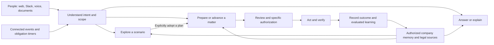
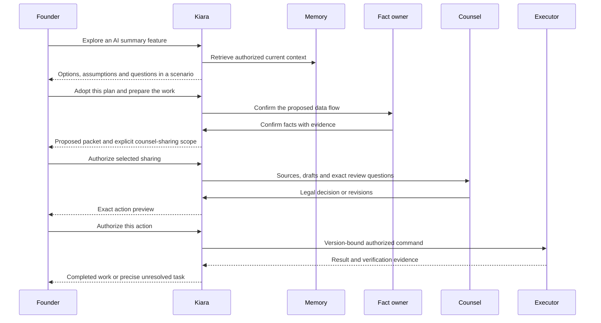
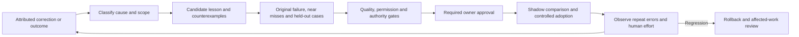
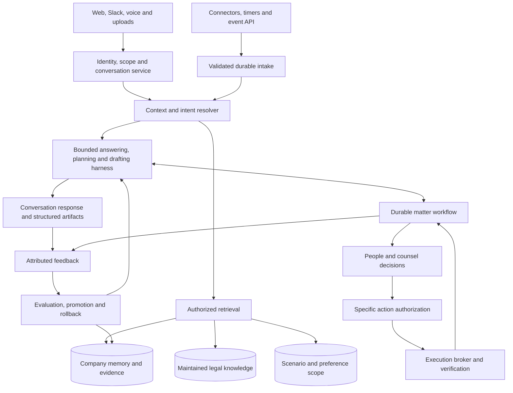

# Kiara — conversation, company memory, and completed legal work

**Authoritative product plan and agent handoff · 27 September 2026**

Use this as the standalone product brief. It defines what Kiara should become, without constraining the design to the current application. It takes precedence over earlier product plans and screen concepts where they differ. Technology choices are proposed architecture decisions; examples are fictional and performance goals are targets to validate.

## 1. The product we are building

**Kiara is a company’s ongoing AI legal operations partner: a product people can talk to, that understands their business, notices relevant changes, prepares useful work, and coordinates that work through an authorized outcome.**

A founder should be able to say:

> “We’re thinking of adding AI summaries to support calls. What should we consider?”
>
> “Explain the customer’s proposed terms in the context of how we operate.”
>
> “Prepare the documents we need and involve our lawyer where necessary.”
>
> “What needs my attention before launch?”

Kiara should also initiate useful conversations: “The proposed implementation appears to send transcript text to a new vendor. Is that intended?”

The experience combines three capabilities:

1. **Understand and help:** answer questions, explain documents, explore options, remember appropriately scoped context and preferences.
2. **Observe and anticipate:** connect business changes, existing commitments, upcoming obligations and maintained legal guidance.
3. **Prepare and complete work:** research within declared coverage, draft, gather facts, request decisions, coordinate counsel, perform authorized actions and verify results.

The product earns its subscription by reducing discovery, repeated explanation, routine drafting, coordination and avoidable rework. Track the total human effort removed, including any new review burden Kiara creates.

## 2. The customer and recurring jobs

Design the experience around growing B2B software companies, roughly 20–200 people, with a founder, operations leader or small legal team owning legal coordination. Their counsel may be outside, fractional, internal or not yet engaged. Design for explicitly declared entities, markets and legal coverage. Accepting an event from a system does not imply expertise in every jurisdiction or industry.

| Customer job | Example | Useful result |
|---|---|---|
| Understand | “What does this indemnity clause mean for us?” | Plain-language explanation, relevant company context, source references and unresolved questions |
| Decide | “Should we accept this requested retention period?” | Comparison with actual practice and commitments, options and decision dependencies |
| Explore | “What if we sell to hospitals?” | A separate scenario with assumptions, questions and specialist-review needs |
| Prepare | “Draft an NDA for this discussion.” | Appropriate approved-template draft, confirmed fields, highlighted choices and review route |
| Monitor | A product change introduces a data recipient | One sourced matter with the right factual question and proposed work |
| Coordinate | “Get this reviewed before launch.” | Defined scope, assigned owners, counsel packet, reminders and tracked decisions |
| Act and verify | “Publish the approved notice.” | Exact action preview, valid authorization, execution and evidence of the result |
| Recall | “Why did we agree to this for Acme?” | The actual scoped decision, supporting facts, version and reviewer |

Everyday explanation can be useful without creating a matter. A hypothetical can remain exploratory. A real obligation or requested work needs a durable record and owner.

## 3. One experience across conversation and structured work

The primary home is **Kiara**: a conversation surface with a compact “Needs your attention” area and a clear view of current company/source scope. A user can begin by typing, speaking, attaching a document or opening an existing matter.

Navigation is **Kiara · Work · Documents · Company · Activity**. Company contains context, playbooks and learning. Connections and settings remain readily accessible from the workspace controls. Work contains matters, tasks, approvals and obligations. This navigation is the product contract for new designs.

Conversation can show real product objects inline: a fact confirmation, source citation, scenario, document preview, proposed change, review request, action authorization or completion receipt. Opening an object reveals the same record in its structured view. A conversation and a matter must not maintain separate copies of the truth.

### Natural-language behavior

Infer whether a user is asking a question, exploring, correcting, instructing, reviewing or approving. Ask a narrow clarifying question when ambiguity changes the consequence. Users should not have to operate an intent-classification menu.

Give the direct useful response first. Then show the basis, material uncertainty and suggested next step. Ask for missing information only when it matters to the answer or action; do not turn every question into a long questionnaire.

Show progress for longer work: “Reviewing the three linked customer agreements,” followed by an actual artifact or a specific blocker. An interrupted conversation must not lose a durable task. Users can cancel an investigation; cancellation blocks future dispatch but cannot undo an action already completed.

“Make it shorter” edits the current draft. “Actually, that is only in staging” proposes a factual correction. “Looks good” is positive review feedback unless it clearly satisfies an already displayed, specifically scoped approval step. Publication, external sharing, notices, signature requests and spending have explicit authorization records.

### Channels

| Channel | Intended behavior |
|---|---|
| Web conversation | Full questions, uploads, scenarios, source inspection, document work and exact-action approvals |
| Slack | Direct conversations, selected-channel intake, short answers and precise owner questions; consequential approvals open the authenticated action view |
| Voice in the app | User-initiated conversation with a visible transcript, interruption/correction and a reviewable summary; consequential actions use a visual confirmation |
| Email | Explicit forwarding/intake, configured notifications and secure review links; email acknowledgment does not silently grant authority |

Voice is another interface to the same context and work. Recording starts only when the user invokes it. The UI explains transcript retention; raw audio is not retained by Kiara by default. Provider processing and deletion behavior must be verified before claiming a retention guarantee. Misheard names, amounts or dates must be resolved before changing consequential records.

## 4. Conversation, scenarios and company truth

This distinction is fundamental: a conversation may contain questions, speculation, facts, instructions and legally significant decisions. Store them with different meanings.

| Record | Meaning | Promotion or effect |
|---|---|---|
| Conversation message | What someone said, when, in which channel and visibility scope | Evidence of a statement; not automatically a company fact |
| Scenario | A possible future with explicit assumptions | Isolated from actual-company facts; becomes planned work only through an explicit decision |
| Candidate assertion | A potentially useful factual claim | Requires appropriate evidence/authority before becoming confirmed |
| Confirmed company fact | An attributed assertion valid for a defined entity, time and scope | Reusable where relevant; conflicts and expiration remain visible |
| Preference | How a person or team wants to interact | Changes presentation/routing within permitted bounds; never creates legal authority |
| Instruction | A request for specific work | Starts or advances an authorized task within scope |
| Decision/approval | An authorized judgment tied to exact content and conditions | Can satisfy a particular workflow gate |
| Reusable rule | A reviewed lesson or standing policy | Affects future work only in its approved scope and version |

“Maybe we should retain recordings for a year” stays inside the scenario. “Our retention setting is 30 days” becomes a candidate fact with attribution; an authorized owner can confirm it. “Use 30 days in this hypothetical” is a scenario assumption. “Change our published retention statement” starts reviewable work.

Visibility is independent of truth status. A confirmed fact may be restricted; a shared idea may still be hypothetical. Conversations can be limited to the individual’s permitted space, a selected team or named matter participants, subject to disclosed workspace administration and retention policies. Never market a conversation as off-record if it is retained.

A prominent “What I’ll remember” control shows proposed durable facts and preferences, their scope and owner. “Keep this within this conversation” prevents reuse as company memory; it does not falsely promise deletion of a retained conversation. Sharing a scenario or summary previews the people and information involved. Model summarization cannot expand access.

## 5. Deliver value in the first session

Start onboarding with **“What would you like help with?”** Offer explain a document, prepare a document, review a planned change, or understand current priorities. The customer can also type their own request.

1. Establish the company/entity and the minimum facts necessary for that request. Accept “unknown.”
2. Accept one document, a description or selected connected sources. Broad integration setup is optional at this point.
3. Produce a useful first result: a grounded explanation, comparison, draft, scenario brief or review packet. Display the source and scope limitations.
4. Ask the user to confirm the few reusable facts that result from this work.
5. Offer connection of relevant repositories, channels and folders to keep that context current.
6. Assign the owners and review rules needed for ongoing work; show monitored coverage and missing access.

For a company without documents, help scope a real requested document using an approved template and confirmed facts. For a company with no current event, answer its real question or review a selected agreement. A rehearsal is available for exploration but never counts as customer activation. Do not manufacture a legal problem to populate a dashboard.

Target a useful result in the first working session, before a large background import finishes. Measure time to accepted useful output separately from setup completion. The customer should leave with something they can use, even when counsel involvement or additional source access is pending.

## 6. Proactive work that earns attention

Monitor selected GitHub repositories, Slack channels, Drive folders, manually supplied changes and a normalized event API. CRM, HRIS, vendor and other systems use the same adapter contract when supported. Each connector declares its scopes, event types, backfill, freshness, deletion handling and execution capabilities.

Correlate related events into one business change. A PR, a launch discussion and a vendor document can enrich one matter. A PR alone does not establish deployment. Customer-facing commitments must be linked to the actual executed agreement and amendments.

A proactive message explains **what changed, why it may matter, what evidence supports it, and the one next useful action**. Route factual questions to factual owners, business decisions to business owners and legal questions to the configured reviewer. Updates stay in the same matter/thread.

Separate urgency from uncertainty. Show whether a date is a contractual obligation, a verified legal deadline, a team launch target or an internal response target. Avoid invented urgency. Quiet hours, digests, escalation and interruption thresholds are configurable; missed or stale source coverage is visible.

Users can say “Only interrupt me when I need to decide,” or “Send product questions to Alex.” Apply presentation/routing preferences within approved delegation. A preference cannot suppress a required escalation or invent another person’s authority. If a user dismisses an alert, capture the reason when needed; silence is not a training label for “irrelevant.”

## 7. Company memory and retrieval

Use MongoDB Atlas for versioned operational records, entity relationships, keyword and vector retrieval. Preserve original documents and source snapshots in encrypted object storage. A separate graph database is unnecessary until measured needs justify it.

Maintain these distinct collections of knowledge:

- Source objects and immutable versions, with exact anchors and permission lineage.
- Company entities, products, data practices, vendors, counterparties, owners and factual assertions.
- Documents, executed agreements, amendments, templates, effective publications and obligations.
- Conversations, scenario branches and personal/team preferences, each with its own visibility and reuse policy.
- Approved playbooks, matter decisions and scoped precedents.
- Feedback, candidate lessons, regression cases and promotion history.
- External legal authorities and maintained jurisdiction/domain guidance, kept separate from company assertions.

Every important fact has an entity, source, author/owner, state, effective period, observation time, visibility, confirmation history and conflicts/supersession. A recent file timestamp cannot replace the authority of an executed agreement. A current operational configuration and a contractual promise can disagree; preserve both and route the discrepancy.

### Retrieval contract

1. Determine the authenticated tenant, actor, purpose, entity and conversation/matter/scenario scope.
2. Resolve exact entities, documents, versions and relationships; identify required evidence.
3. Enforce current source eligibility and access restrictions before search. Recheck candidates against authoritative metadata before their text reaches a reranker or model, since indexes can lag.
4. Combine exact lookup, keyword retrieval and semantic similarity. Parse contracts into coherent clauses, definitions, exceptions, tables and schedules. Preserve source anchors and parent context.
5. Rerank relevant authorized evidence and include required definitions and contradictions. Embedding/chunking/model choices must be benchmarked on Kiara’s actual tasks and versioned.
6. For exhaustive questions—such as which customers require notice—enumerate the applicable agreement inventory. Top-k similarity cannot prove all affected contracts were checked.
7. Return a bounded, cited context packet with unknowns and coverage gaps. Use it for both conversation and workflow agents.

Personal preferences, hypothetical assumptions and historical decisions must not accidentally override current company facts or law. Retrieval must respect their type, authority, time and scope as well as similarity.

## 8. Legal knowledge and answer quality

Kiara needs both company context and an explicit legal-knowledge service. A model’s general knowledge is insufficient grounds for claiming current jurisdiction-specific coverage.

Create a coverage registry for each supported domain/jurisdiction: source set, owner, qualified reviewer, effective dates, review/freshness policy, known limitations and status. Begin the product’s declared coverage around supported software-company workflows; expose specialist or unavailable coverage clearly.

Use official sources and appropriately licensed research where needed. Record authority type, jurisdiction, publication/effective dates, version, source URL, last verification and review owner. Statutes, regulatory guidance, contractual commitments and company policy remain distinguishable. Never fabricate a citation or present a company preference as law.

Assign a Kiara legal-content lead and qualified domain/jurisdiction reviewers responsibility for source selection, updates and approved guidance. Monitor maintained sources on a defined schedule, and check freshness when answering time-sensitive questions. A changed source creates an applicability-review task. Only a reviewed applicability assessment identifies affected customer matters or playbooks. Overdue coverage is marked stale; avoid authoritative conclusions that depend on unverified material.

Answers should contain the useful conclusion or explanation, supporting company facts, relevant contractual/legal sources where applicable, material assumptions and practical options. Explanation, approved-policy application and specialist legal judgment receive different handling. Novel or high-impact interpretation, conflicting sources or unsupported scope triggers a focused review packet. Do not force counsel review for every plain-language explanation, or overwhelm ordinary answers with generic disclaimers.

## 9. Three levels of work and clear authority

| Route | Qualifies when | Behavior |
|---|---|---|
| Direct assistance and deterministic triage | Explanation or evidence lookup; duplicate/irrelevant event under a narrow approved rule | Answer, summarize or record disposition; no unnecessary consultation or external effect |
| Standing-policy work | Confirmed facts satisfy a current approved playbook, template and delegation with no exception | Prepare/perform the specified internal work; require the configured business and external-action gates |
| Matter-specific legal review | Novel interpretation, changed legal terms, conflicting commitments, material exceptions or unsupported prerequisites | Prepare a bounded packet for qualified review and retain an accountable owner |

A fact owner confirms business facts. A business owner decides intent, feasibility, sharing and approved spend. A legal reviewer resolves legal interpretation and content. A publisher/sender authorizes exact publication or recipients. A signatory signs through the authorized process. One person can hold several roles, but each decision records the capacity used.

An approval binds the actor, role, matter, proposal hash, source snapshot, document versions, policy version, conditions, recipients/destination, timing and validity. Recheck those bindings at dispatch. Material changes invalidate affected approvals. A natural-language interface does not relax this contract.

Signed originals are preserved. Proposed contractual changes use an amendment or replacement workflow. Effective public documents get proposed successor versions. New documents use appropriate approved templates. Other valid remedies include changing product behavior, withdrawing a commitment, negotiating an exception or taking no action after an authorized assessment.

## 10. Counsel, including companies without a lawyer

Support two explicit routes: **bring existing counsel** and **request help finding qualified counsel**.

Existing counsel receives a named, scoped invitation to a matter, a one-page brief, verified facts, unknowns, relevant clauses, authorized source excerpts, proposed redlines, specific questions and the approved engagement scope/budget if supplied. Support Word review and re-import without losing version history. Counsel can return edits, ask for evidence, record legal clearance or recommend another remedy.

For customers without counsel, the product provides an opt-in assisted referral to a maintained network of independent providers. Collect only the necessary jurisdiction, domain, entity, urgency and matter description for matching. Before sharing substantive documents or engaging work, show the proposed recipient and sharing scope; complete the provider’s intake/conflicts process and the customer’s approval of engagement terms, fee or cap, and expected response time. The customer engages the provider; professional fees are explicit and separate from Kiara’s subscription.

This route has an operational prerequisite: qualified provider coverage and availability must be established before the corresponding service is offered. Product and legal operations own that readiness. If no provider is available, show that fact, provide an exportable review packet and keep the legal gate pending. Do not advertise instant review or imply an engagement exists merely because an invitation was sent.

Escalation includes non-response, unavailable expertise, rejected scope and a proposed budget increase. No new spending or material sharing occurs without the relevant authorization. This makes “send it to a lawyer” a defined customer journey rather than a dead end.

## 11. From conversation to completed work

The work record is a **matter**, containing the change or objective, related conversations/scenarios, evidence, facts, affected documents, decisions, tasks, approvals, deadlines and completion evidence.

State progression: **Observed → Triaging → Needs facts → Proposed → Business review → Legal review → Authorized action → Executing → Verifying → Closed**. Approved policy can skip a gate with a recorded basis. Waiting, escalation, stale approval and uncertain execution are explicit blocking conditions. Specialist handoff remains open. No-action and withdrawn-change outcomes have authorized reasons and reopen conditions.

A provider timeout after submission creates an uncertain action. Reconcile before retrying. Queued is different from delivered; delivered is different from accepted; requesting a signature is different from a completed agreement. Manual completion needs defined evidence and a named verifier, with human attestation distinguished from direct read-back.

All required tasks must be evidenced before closure. Corrections after closure can reopen affected work. A harmful completed external action requires corrective work; a database rollback cannot unsend it.

## 12. Learning that improves the relationship and the work

Learning is continuous, scoped and inspectable. Useful learning does not require changing model weights.

| Learning type | Example | Adoption rule |
|---|---|---|
| Personal preference | “Give me the short answer first.” | Apply immediately to that person; visible and reversible |
| Team operating preference | Product questions go to Alex | Confirm the user’s routing authority and delegation; record team scope |
| Company correction | Feature is staged, not deployed | Authorized fact confirmation updates context and invalidates affected proposals |
| Scoped precedent | A negotiated clause accepted for Acme | Store with counterparty, facts and reviewer; do not promote it to universal policy |
| Procedure or legal playbook | Require release evidence before asserting deployment | Propose a versioned lesson, evaluate it, obtain the responsible owner’s approval |
| Model/retrieval strategy | Improved ranking or drafting configuration | Compare on a frozen benchmark and holdout, then use controlled promotion and rollback |

Capture reasons from corrections, returned edits, rejected suggestions and verified outcomes. A polished document is not automatically a correct legal decision. Approval of one draft is not permission to train across customers.

Turn deterministic mistakes into enforceable checks where possible. For probabilistic judgments, measure recurrence rather than promise impossibility. Keep lessons tenant-scoped by default, with owner, source, effective/review dates, evaluation results and rollback target. Rollback identifies affected work for review. Deletion and access revocation propagate into derived memories, summaries and evaluation datasets under the configured retention policy.

## 13. Target architecture

Use a modular TypeScript application, managed Temporal for durable workflows, MongoDB Atlas for company records and retrieval, encrypted object storage for source artifacts, and a restricted execution broker. Separate interactive response work, background ingestion, durable workflow workers and evaluation workloads. Model choice is benchmark-driven and pinned by version.

The conversation service stores messages, active entity, participants, linked artifacts and visibility. The context resolver selects current facts, relevant legal sources, scenario assumptions and preferences without merging their authority. The model emits typed proposals for state changes; an authorized service validates and applies them. It never directly rewrites company truth from free text.

Define typed contracts for `Conversation`, `Message`, `Scenario`, `FactAssertion`, `Preference`, `LegalAuthority`, `CoverageEntry`, `Matter`, `Proposal`, `Approval`, `Action`, `CounselEngagement` and `LearningCandidate`. Each has stable identity, tenant/scope, version, provenance and lifecycle appropriate to its purpose.

Connector events carry authenticated installation, external event/object/revision IDs, occurred/received times, type, actor, evidence pointer and scope. Durably accept events and an outbox entry; replayable dispatch starts or signals workflows with stable IDs. Use reconciliation for missed, duplicated and out-of-order changes. Display freshness and gaps. Do not assume one atomic transaction across storage, orchestration and external providers.

Agent activities have a task, allowed tools, evidence snapshot, output schema, step/time/cost budget and stop conditions. Initial bounded strategies can use one planning pass, two targeted retrieval expansions and one verified revision, subject to evaluation. Long-running investigations return a run ID and visible progress; budgets expiring create an owned blocker, not an infinite loop.

Re-check access before retrieval text reaches a model and before display, sharing or action. Source content is evidence, not a privileged instruction. Execution credentials are isolated from models. Detect and deny revoked access before asynchronous index cleanup; disclose provider reconciliation limits. Apply deletion lineage to originals, chunks, embeddings, summaries, facts, scenarios, caches and evaluation records, with explicit retention exceptions and backup expiry.

## 14. Screen contract

| Surface | What the user sees | Primary behavior |
|---|---|---|
| Kiara home | Conversation, active company/scope, relevant attention items and source health | Ask, speak, attach, explore or resume work |
| Conversation | Direct response; citations; uncertainty; inline artifacts; visible intent/scope | Correct understanding, inspect basis, continue or authorize a defined step |
| Scenario workspace | Assumptions, options, dependencies and affected commitments | Compare possibilities, change assumptions, share selectively or adopt a plan |
| Work | Matters, tasks, approvals and obligations with owners | Resolve the next decision and track completion |
| Matter detail | Overview, conversation, evidence, proposed changes, approvals and delivery | Move between discussion and the same durable work record |
| Documents | Authoritative versions, signed originals, templates, proposals and obligations | Explain, compare, draft or review a controlled change |
| Company context | Known, inferred, conflicting and missing facts with provenance | Confirm/correct facts and inspect what Kiara remembers |
| Playbooks and learning | Rules, scope, origin, tests, owners and versions | Review a lesson, inspect its effect or roll it back |
| Counsel | Assigned packet or optional matching/engagement status | Request help, approve scope, exchange redlines and track review |
| Connections/settings | Selected access, sync health, coverage, owners, preferences and usage | Control what Kiara can see and do |
| Activity/value | Decisions, external effects, learning and comparable human effort | Verify outcomes and understand customer-specific value |

Design the main conversation as a working surface, with documents or scenario details beside it on desktop and accessible as full views on mobile. Always expose the current entity and visibility. Avoid decorative agent activity, unexplained scores and notification-heavy dashboards. Build keyboard, screen-reader and responsive behavior into the interaction contract.

The public product page should lead with **“Talk to Kiara. Keep legal in step with your business.”** Show three concrete journeys: ask a company-specific question; catch a relevant change; prepare and complete legal work. Demonstrate the same scenario moving from conversation to sources, draft and approval. Include onboarding, counsel options, learning, actual coverage and data controls. Savings, provider availability and security claims require substantiation.

## 15. Complete demonstration: Northstar and RelayAI

The demonstration must span the product rather than stopping at a draft.

1. A founder asks about adding AI summaries. Kiara explains relevant questions using the company’s current context and keeps proposed choices in a scenario.
2. The founder explores synthetic-only data. Company memory still says nothing about a deployed RelayAI integration.
3. The founder chooses a plan involving customer transcripts and requests preparation. Kiara creates a matter, records the decision and requests the missing facts.
4. A GitHub PR and Slack launch discussion arrive. They join that matter. Engineering confirms planned versus actual data flow; vendor location and terms remain separate questions.
5. Kiara finds the relevant documents and enumerates applicable agreements. It proposes the appropriate work and alternatives, with a clause-specific notice matrix where required.
6. A new user asks “Why does this matter?” in Slack. Kiara gives a short, permission-scoped explanation and links to the same matter.
7. The owner authorizes a scoped counsel packet. Existing counsel reviews it, or an explicitly approved referral/engagement follows the no-counsel route.
8. Counsel returns edits or another remedy. Changes create new versions and reopen affected business or legal decisions.
9. The owner authorizes exact publication/sending actions. Kiara executes or assigns them, verifies completion and reports unresolved tasks honestly.
10. A factual correction and drafting feedback become the appropriate scoped memory or learning records. A later comparable matter uses the approved lesson without re-asking settled, current facts.

## 16. Acceptance criteria and evaluation

Evaluate conversation quality and durable work together. Include independent legal/domain review where the task requires it; model self-grading alone is insufficient.

| Scenario | Required result |
|---|---|
| “Explain this contract” | Useful sourced explanation without forcing unnecessary onboarding or creating work the user did not request |
| Hypothetical retention change | Scenario assumptions never appear as current company practice |
| Ambiguous “go ahead” | The system resolves consequential ambiguity before external action |
| Unauthorized factual correction | A disputed candidate is preserved; authoritative facts are not silently overwritten |
| Explicit personal preference | The next response reflects it without changing company policy or another user’s preferences |
| First session, no integrations | A supplied document or real request yields a useful bounded result |
| Event arrives during a conversation | It updates or links the right work record without duplication or lost context |
| Restricted source exists | Neither response, summary, scenario, notification nor approval packet leaks it |
| Legal coverage is stale/unsupported | Answer scope is clear and required qualified review remains pending |
| No counsel available | Exportable packet and owned pending task; no fabricated engagement or approval |
| Counsel changes draft v3 | v3 approval cannot execute v4 |
| PR merged but feature not deployed | Planned state remains distinct until valid release evidence/confirmation |
| Signed agreement needs changes | Original remains intact; separate amendment/replacement process is proposed |
| Timeout after external send | Reconciliation prevents blind duplicate retry; status remains honest |
| Promoted lesson regresses | Rollback and identification of affected matters both occur |
| Voice mishears a vendor or date | Ambiguity is corrected before consequential state or action changes |

Measure first useful output, grounded answer quality, scope/intent errors, improper memory promotion, task evidence retrieval, audited missed events, unnecessary interruption, repeat errors, rework, completion integrity and total human minutes per comparable outcome. Report undated work separately from legal/contract deadlines and customer response targets.

Time savings equal comparable baseline effort minus all effort with Kiara, including setup, review and correction, counted once. Financial savings require customer-specific billing evidence or clearly labeled estimates. A lower-effort fixed-fee engagement may improve throughput without lowering an invoice.

Use release gates for permission, approval, duplication and memory-contamination tests. Zero failures in a defined suite is a qualification target, not proof that a probabilistic system can never fail.

## 17. Workstreams and build dependencies

These workstreams define one product. Engineering sequencing should follow dependencies and demonstrate the complete customer journey repeatedly.

| Owner | Deliverable | Dependency and proof |
|---|---|---|
| Product/design | Conversation, scenario, matter and approval interaction contracts | Users can explain what is hypothetical, remembered, pending and done |
| Platform | Identity, scoped records, versioning, audit, durable workflows and action broker | Isolation, revocation, interruption and retries behave correctly |
| Knowledge engineering | Source parsing, authority/lineage, company memory and hybrid retrieval | Correct evidence and exhaustive inventories are distinguishable |
| Applied AI | Intent resolution, grounded answers, scenario reasoning, bounded planning/drafting and verification | Conversations produce useful artifacts without unapproved state promotion |
| Integrations | Selected-source connectors, manual/API intake, Slack conversation and coverage UI | New/updated/deleted/replayed events preserve scope and correlate correctly |
| Legal content operations | Coverage registry, source maintenance, approved guidance and playbooks | Current reviewed coverage and unavailable/stale coverage are visible |
| Counsel operations | Existing-counsel collaboration and qualified opt-in referral process | Engagement, sharing, fees, capacity and escalation are concrete |
| Evaluation | Conversation/workflow benchmarks, feedback taxonomy and learning promotion | Corrections improve comparable cases without breaking critical controls |
| Customer experience | Goal-first onboarding, voice interaction, measured-value report and product page | Customer gains useful work in the first session and understands its basis |

Implement the shared identity and object contracts first. Build the conversation-to-scenario-to-matter path alongside versioned memory. Add source-driven enrichment, legal-source coverage, counsel collaboration, verified execution and evaluated learning against the same end-to-end example. No independent chat backend should bypass the work, permission or memory services.

The agent receiving this brief should produce:

1. A dependency-aware implementation plan mapping every requirement to a component and owner.
2. Object schemas, intent/state transitions, service/tool contracts and exact authority checks.
3. Updated interaction designs and renders for conversation, scenarios, matter work and the counsel/no-counsel journeys.
4. A working end-to-end demonstration covering a real user question, deliberate scenario adoption, source enrichment, review and verified or explicitly pending completion.
5. Automated and expert-reviewed acceptance evidence, clearly separating implemented behavior, simulated dependencies and remaining work.

Follow applicable repository instructions and installed framework documentation when implementing. Preserve unrelated work and coordinate with the separate platform-review effort. Treat existing code as reusable material where appropriate, while building toward this product contract. Resolve routine implementation choices autonomously; surface only consequential unresolved product or operational decisions.

**Definition of success:** a customer can talk to Kiara naturally, receive useful company-specific help, explore without contaminating reality, let Kiara notice meaningful changes, complete legal work with appropriate authority, and see that the next interaction benefits from what was correctly learned.
