# Kiara — screen and interaction specification

26 September 2026 · Target product design. All renders use fictional Northstar data. They specify an experience; no connector, publication, approval or notification in the concept changes an external system.

## Product language and navigation

The customer opens a company workspace. Its persistent navigation is **Inbox · Documents · Company context · Playbooks & learning · Connections · Activity**. A matter lives inside Inbox and is deep-linkable. Workspace settings hold people, roles, notification preferences, retention/export controls, billing and security configuration. Counsel sees a restricted assigned-matter surface, not the company-wide navigation.

Use “matter” for a unit of legal work, “evidence” for the cited source record, “proposed change” for unapproved work, “legal clearance” for the reviewer’s decision, and “authorize publication” or “authorize send” for a specific external action. Do not use a generic “Approve” button when its effect could be misunderstood.

The concept’s top view picker lets a reader explore the design; it is presentation navigation, not a production toolbar. Production users enter onboarding, their workspace or an assigned counsel matter through the appropriate route. The Notifications view renders the private Slack request and email fallback described below.

## 1. Inbox

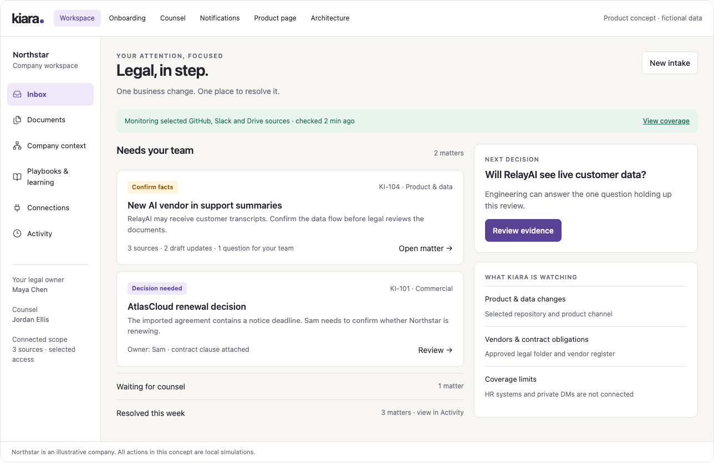

**Purpose:** tell the current user what deserves their attention and make the next decision obvious.

- Header: company, role, date/time-zone context and “New intake.”
- Coverage strip: monitored sources, last successful relevant sync, unresolved gaps, link to Connections. Green means selected sources are current; it is not a legal compliance score.
- Groups: Needs your team, Waiting for counsel, Ready for authorized action, Resolved. Filters: assigned to me/team, matter type, entity and status. Search is permission scoped.
- Matter row: plain title; next action; accountable owner; verified due date if one exists; urgency reason; supporting source count; state. Evidence quality and urgency are separate.
- A decision panel brings the most useful next question into focus. It does not create another copy of the matter.
- Related events join the existing matter. A changed deadline or materially new fact updates that matter’s record and notification thread.

**Primary interaction:** open a matter or answer its scoped factual question. “New intake” opens a short form: what changed, relevant product/customer/vendor, intended date, evidence links or upload, business owner, sensitivity. Kiara proposes related matters before creating another.

**States:** no open matters; ingest in progress; no sources connected; stale source; current-but-limited coverage; owner not assigned; permission-restricted matter. An empty state shows coverage and a useful intake action, never “your company is legally safe.”

## 2. Matter workspace

**Header:** matter ID, change title, type, relevant entity, owner, counsel, status and source-backed due date. The top-level next action changes with state.

Four core tabs are visible:

| Tab | Content | Primary action |
|---|---|---|
| Overview | What changed; possible consequence; recommended work; what is unknown; next owner | Resolve the blocking question or proceed to review |
| Evidence | Timeline; exact source excerpts and revisions; fact confirmations; conflicts; inaccessible/missing sources | Confirm, correct or request a fact |
| Proposed changes | Affected-document bundle; source-to-proposal links; redlines; unresolved placeholders; alternative remedies | Accept/revise the packet for the next review |
| Approvals & delivery | Required decisions; version-bound approvals; exact action scopes; execution receipts; closure checklist | Approve the named step or inspect why it is blocked |

Every proposed impact links back to the supporting facts, applicable playbook and document clauses. A user can challenge the conclusion without deleting its evidence. “No action needed” requires an authorized reason. “Not now” needs a reason and revisit trigger; it cannot silently hide a real deadline. “Escalate” records the recipient and leaves the work open.

A discussion sits within the matter and can refer to clauses, questions or tasks. Sensitive legal discussion has a separate visibility scope. The general business owner sees an actionable task even when underlying legal advice must stay restricted.

**States:** insufficient evidence; investigation budget exhausted; conflict; stale proposal; external reviewer unavailable; no reviewer assigned; blocked delivery; uncertain write; reopened matter. Each state explains the specific blocking input and the person who can resolve it.

## 3. Evidence and company facts

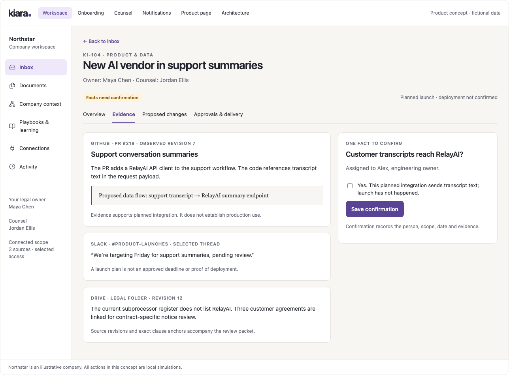

The Evidence tab separates **observed source content**, **model inference**, and **human-confirmed fact**. A source drawer contains source app, title/object, author when relevant, occurrence/observation times, immutable revision or captured hash, excerpt or page/line/section anchor, access scope and current availability.

A fact card contains statement, entity, business-effective date, observed date, state, confirming owner, evidence links and dependencies. “Confirm” records the user and scope; “Correct” requests the replacement statement and reason; “Conflicts with…” opens both evidence trails.

For the RelayAI example, the initial source supports a proposed code path. The requested confirmation establishes the intended data flow and release status. Vendor location remains a separate unknown. Confirming one fact does not resolve all others.

The product should reuse a current, authorized confirmed fact where scope matches. Re-asking is appropriate when the source changed, the fact expired, the new matter concerns a different scope, or conflicting evidence appeared.

## 4. Proposed document changes

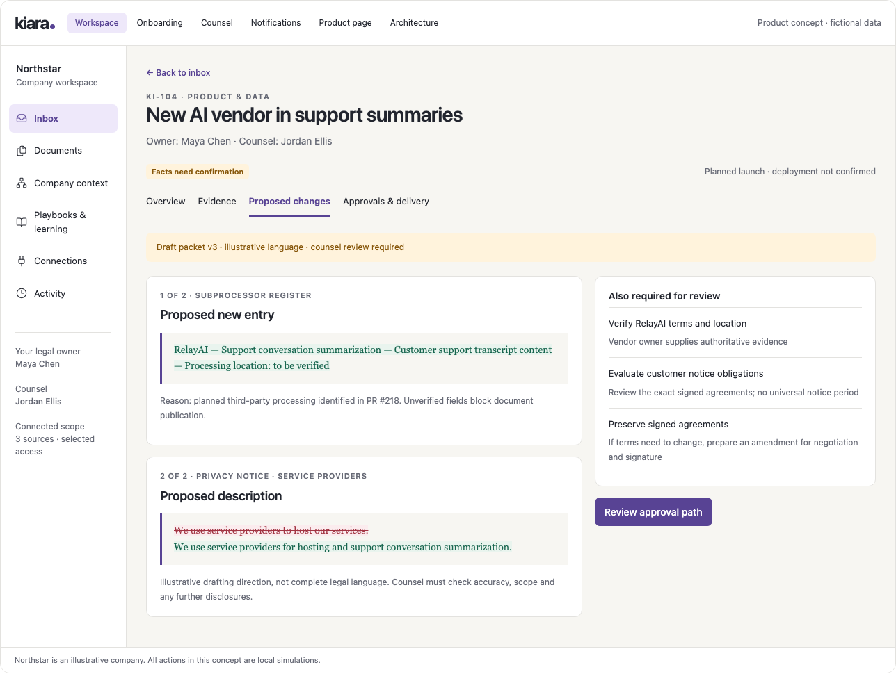

**Layout:** document bundle on the left; original/proposed/changes view in the center; rationale and linked evidence beside the selected clause. The compact concept render shows the central content.

For each file, display title, source and current revision, status (draft/effective/signed), proposed revision, affected sections, unresolved placeholders, template/playbook version and intended action. Reviewers can accept a section, return an edit or request supporting facts. Bulk approval remains limited to an explicitly enumerated packet.

New-document creation starts from an approved template. It shows why a new document is proposed and which checked repositories contain no suitable authoritative document. “None found” always has a declared search scope. The preview lists required factual fields and legal choices rather than inventing answers.

Document editing preserves supported formatting, tables, numbering, cross-references, comments and tracked changes. The backend performs a structure-aware comparison and visual rendering check before review. If fidelity is unsupported, provide a proposed replacement and explicit manual editing task, not a destructive in-place write.

For an executed agreement, the original is immutable in the product record. Proposed changed terms are presented as a separate amendment or replacement agreement with negotiation/signature tasks. Updating a public notice is not the same action as amending a contract.

**Alternatives:** a matter can recommend changing product behavior, reversing a proposed business commitment, asking for an exception, or doing nothing after review. The UI should not funnel every discrepancy into a document edit.

## 5. Approvals and delivery

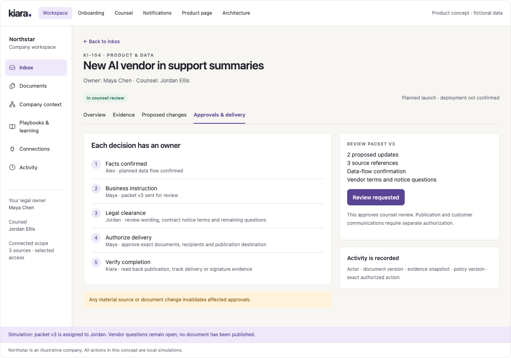

Show each required gate as a named decision, not a generic progress percentage. For each gate: role/person, exact scope, document/proposal version, conditions, decision and timestamp. Parallel factual questions can appear together; dependent approvals wait until prerequisites are satisfied.

The final action preview is concrete:

| Action | Confirmation displays | Completion evidence |
|---|---|---|
| Share packet with counsel | Named recipients, access expiry, selected material, review scope | Access grant and delivery receipt |
| Publish policy | Approved content version, destination, effective time and publisher | Read-back hash/revision and accessible published target |
| Send notice | Approved content, recipients, channel and timing | Provider receipt plus delivered/bounced/unknown distinction |
| Request signature | Signatories, final document, signing provider and order | Completed envelope and final executed document |
| Complete manually | Specific task and acceptable evidence | Recorded artifact plus reviewer verification |

If a target document changes after approval, show the conflicting revision and require revalidation. A queued message is not a delivered notice. An email open is not agreement acceptance. A signing request is not an executed contract.

For routine work within a counsel-approved standing policy, show “Legal basis: approved playbook version X” and the predicates that matched. Material deviations route to a reviewer. The product must not pretend there was a fresh counsel approval when it used delegated policy.

## 6. Documents

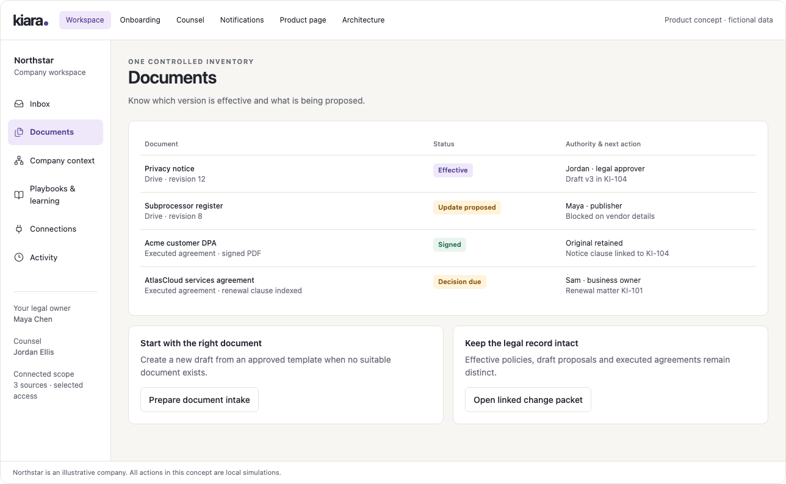

An authoritative register, not a generic file browser. Columns: document name/type, legal entity and counterparty, owner, status, effective/signed dates, current revision, related matters, upcoming obligations and provenance.

Document detail shows lineage, signed original and amendments, version comparison, extracted obligations, clause search and open proposals. The user can designate an authoritative version within their role. Retirement removes a document from current-answer retrieval while preserving authorized historical use.

Filters distinguish templates, policies, unsigned drafts, effective publications, executed agreements and superseded records. Duplicates can be linked as copies without losing source provenance. A PDF with unreadable text is marked unparsed, with a re-upload/OCR task; it is not represented as successfully understood.

## 7. Company context

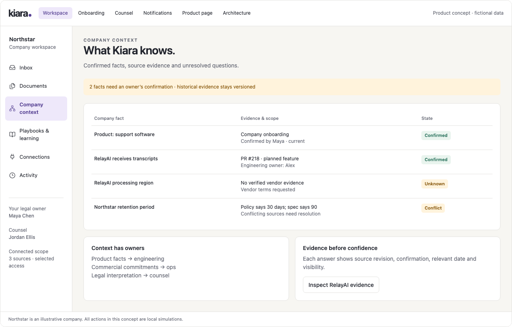

Default to a readable fact table organized by Company, Products, Data practices, Vendors, Customers/commitments, Jurisdictions and Owners. A relationship view can show “product → vendor → data category → agreement → obligation” for a selected matter; it should answer a question rather than display an unreadable full-company graph.

Each entity page contains confirmed facts, inferred facts, conflicting evidence, current relationships, source history and open matters. Unknowns form a prioritized queue based on which work they block. Bulk fact confirmation is allowed only when every assertion and source is reviewable.

The owner can ask a natural-language question such as “Which agreements are affected if we change retention?” The answer is grounded in current authorized facts and links to affected records. If the user asks for work, Kiara creates a reviewable proposed matter. Chat remains a way into the structured product, not a separate history that bypasses it.

## 8. Playbooks & learning

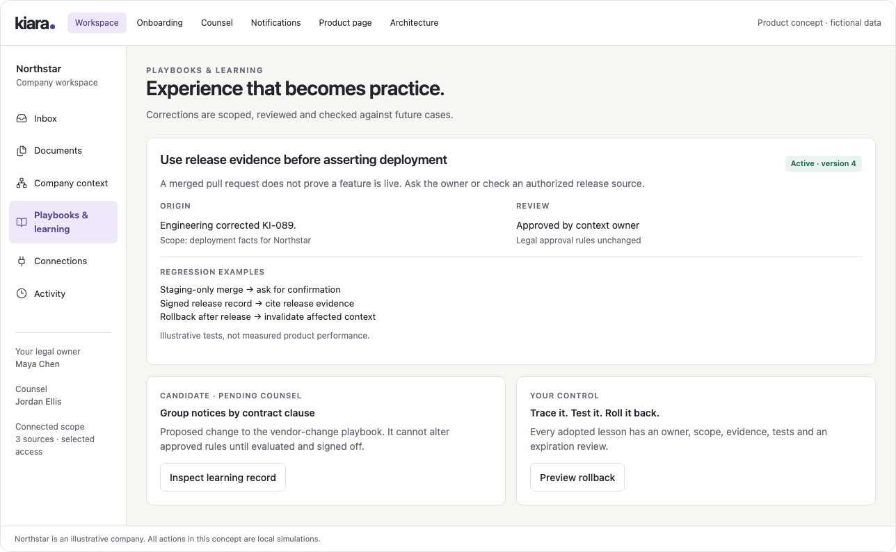

There are two related inventories: approved playbooks and candidate/active learning records. A playbook declares domain/jurisdiction scope, trigger, evidence prerequisites, templates, reviewer route, permitted actions, exceptions and owner. It has an effective version and review date.

A learning record answers: what went wrong, what changed, where the lesson applies, who reviewed it, what tests ran, what happened after promotion, and how to undo it. UI sections: origin; proposed behavior; scope; before/after case; regression and holdout results; owner decision; rollout; rollback.

Available decisions: accept for this matter, correct a fact, propose reusable precedent, propose playbook change, reject candidate, narrow scope, defer, or roll back an active version. A thumbs-up on drafting quality does not change a legal playbook. Users can inspect why a lesson affected a recommendation.

Live learning metrics should show denominator and evaluation date, not invented confidence. The concept’s example tests are labeled illustrative. Automated evaluation failure leaves the candidate inactive and explains which checks failed.

## 9. Connections and workspace settings

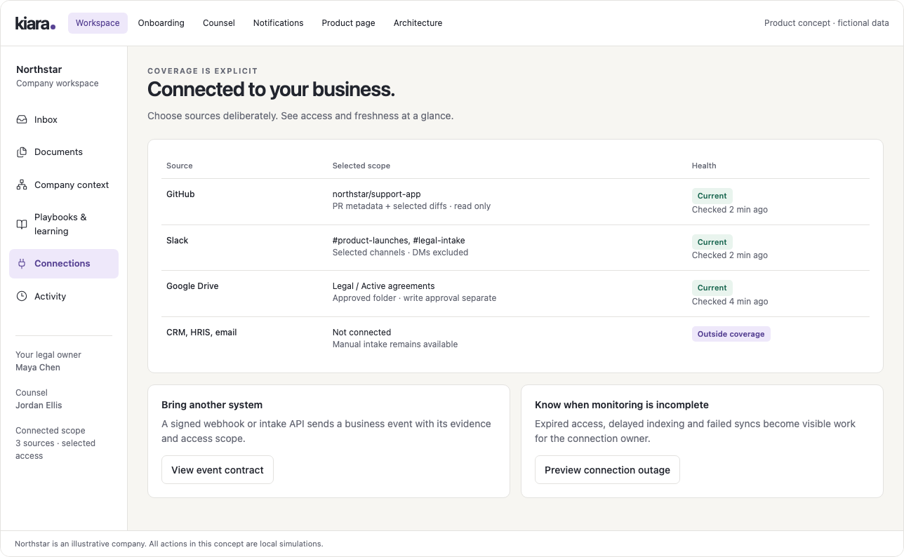

Each connection shows app, workspace/account, selected objects, permissions, connection owner, last event, last successful reconciliation, indexing watermark, errors, backfill range and monitored event types. Read and write capabilities are separately visible. Actions: change scope, reconnect, pause monitoring, revoke write access, replay a permitted interval, export coverage.

When access is revoked, affected sources immediately stop appearing to unauthorized users; dependent matters show incomplete evidence. The recovery view lists what needs re-sync and does not quietly count the outage as observed time. Connector health does not mean legal review has completed.

Workspace settings contain:

| Area | Required controls |
|---|---|
| People and roles | Workspace members, entity/matter scope, designated owners, delegates and signatories |
| Counsel | Named guests, assigned matters, expiry, approved sharing and engagement details |
| Notifications | Per-role channels, quiet hours, business calendar, reminder/escalation policy and digest settings |
| Legal coverage | Configured domains/jurisdictions, approved playbooks and specialist contacts |
| Data lifecycle | Retention, deletion/export requests, legal holds, source revocation and backup expiry information |
| Security | Authentication configuration, sessions, role changes, access logs and supported enterprise controls |
| Usage and billing | Included monitored scope, ingestion/processing usage, cost limits and explicit overage controls |

## 10. Activity and customer value

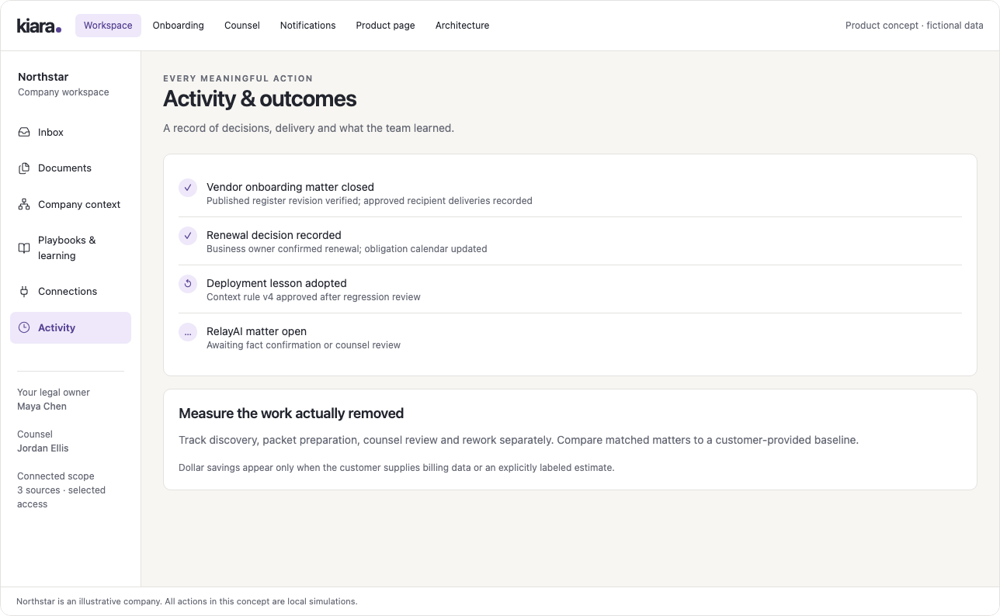

Activity records decisions and actual effects. Every row can link to the matter, actor, version, evidence and receipt. Separate operational traces from the customer-readable decision history; customers should not have to interpret model token counts to understand an action.

The value view compares like-for-like matters across discovery, packet preparation, counsel review, coordination and rework. It distinguishes measured time, customer estimates and unavailable data. It includes setup effort and false-positive review burden. Financial values appear only with a defensible customer-specific basis.

Useful filters include date, entity, workflow and outcome. Closed—no action, completed action, withdrawn change, specialist handoff and reopened work are distinct. A handoff cannot inflate completed-matter counts.

## 11. Onboarding

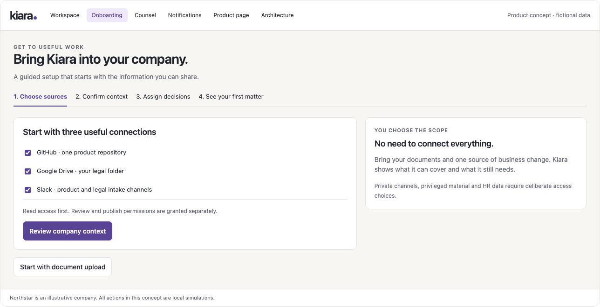

Four visible steps compress the underlying setup work: **Choose sources → Confirm context → Assign decisions → See your first matter**. The six operational moments in the product plan sit within these four screens.

Source selection includes an upload/manual path and exact scope preview. Context confirmation includes legal entities, markets, products and document authority. Assign decisions covers both roles and counsel-sharing preferences. The final screen shows coverage, missing context, reviewer assignments and a real detected matter if available. If no real matter is found, offer an explicitly labeled rehearsal.

Preserve progress and allow an administrator invitation when OAuth permissions are missing. Let useful permitted ingestion continue while another source is pending. Target a short active setup session; never present background import completion as complete legal coverage.

## 12. Counsel room

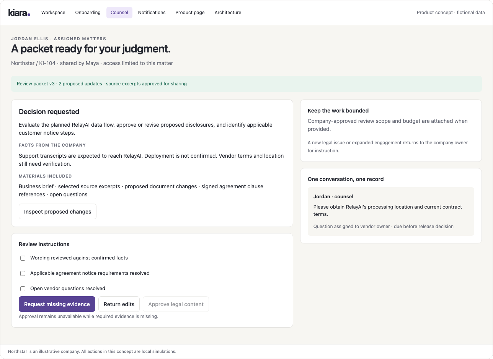

Counsel enters through an authenticated invitation scoped to named matters. The landing view shows the question asked, engagement scope, company owner, proposed deadline, packet version and open questions. Tabs or sections provide business brief, approved source excerpts, relevant clauses, redlines, discussion and decisions.

Counsel can request a fact from a specific owner, return tracked changes, annotate reasoning, propose an alternative, approve exact content within their remit, or record no action. A change of scope or fee assumption returns to the business owner. Word export/re-import and secure document links support existing review habits.

Unavailable materials show why they are missing and who can authorize sharing. The room does not expand access when counsel asks for another document. “Privilege” is a matter-specific legal/access designation under the customer’s policy, not an automatic label on all communications.

### Notifications that lead to the next decision

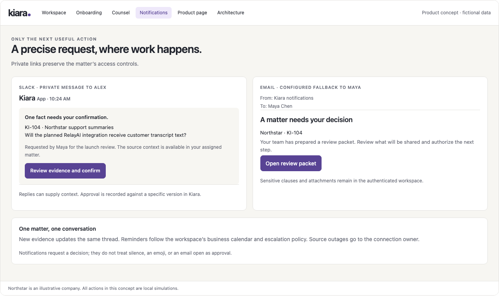

Slack and email messages contain a minimal matter reference and one useful next action. The assigned engineering owner receives a factual question; the business owner receives a packet-sharing decision; counsel receives a review request after sharing is authorized. A secure link takes the recipient to the exact evidence or versioned decision. Reminder and escalation rules are explicit workspace settings. The notification surface does not turn a chat acknowledgment into legal approval.

## 13. Public product page

Headline: **Keep legal in step with your business.**

Subhead: **Kiara watches the tools your team uses, connects business changes to your legal documents, and prepares the next step for your team and counsel.**

Primary CTA: **Start your workspace.** Secondary CTA: **Explore a sample matter.** The concept uses equivalent descriptive action labels. The sample opens the Northstar example with fictional-data labeling.

The full page order is hero and sample; change-to-completion workflow; recurring use cases; counsel review experience; company context and learning; integrations and coverage; security/control; package explanation; FAQ; final CTA. Exact copy and evidence constraints are in [positioning and experience](positioning-and-experience.md).

Use actual product views. Describe benefits through the work removed: less fact gathering, useful first drafts, fewer coordination loops. Publish customer logos, certifications or numeric savings only when substantiated. Keep the main page about the customer’s work; explain vectors and model orchestration on a technical architecture page.

## 14. Architecture view

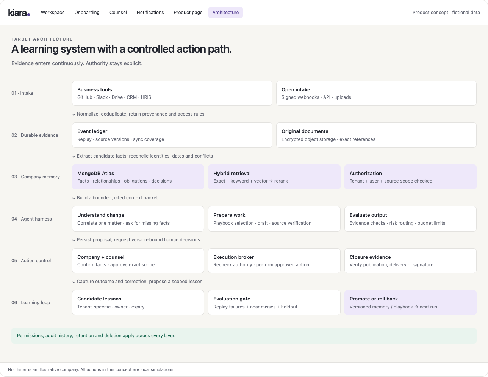

This is an explanatory view for product and engineering review, not an everyday customer requirement. It connects intake, durable evidence, company memory, the harness, action control and learning. Permission checks, source versions and durable workflow state span the system rather than appearing as an optional final filter.

The Markdown product plan also contains diagrams for the customer journey, system architecture and correction/promotion loop. The CTO specification supplies data and interface details.

## Responsive and accessible behavior

The desktop uses a stable sidebar and readable document workspace. At narrow widths the navigation wraps above the content, split panels stack, and approvals remain fully named. Evidence and version information remain accessible without hover. Color is paired with explicit text for every status.

Keyboard focus remains visible. Buttons have accessible names; state changes are announced; form fields are labeled; destructive or external actions get a concrete action preview. Actual implementation must meet an accessibility acceptance review, including tab semantics, focus after navigation, redline reading order and screen-reader access to source citations.

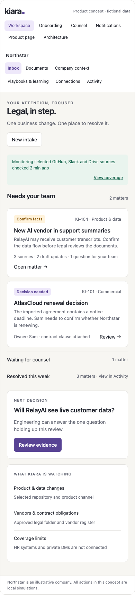

## Concept verification

The rendered concept was checked in a local headless browser at 1024, 736, 390 and 320-pixel content widths across its six top-level views. Checks exercised the missing-fact block on counsel handoff, fact confirmation, successful simulated handoff and the four onboarding steps. No JavaScript errors were observed in that run. The 17 renders include desktop, mobile and dark appearances.

These checks validate only the presentation and local interactions. They are not evidence that the proposed backend, permissions, legal reasoning or external execution have been implemented. [Verification record](renders/verification.json).
