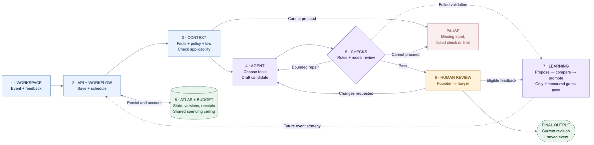
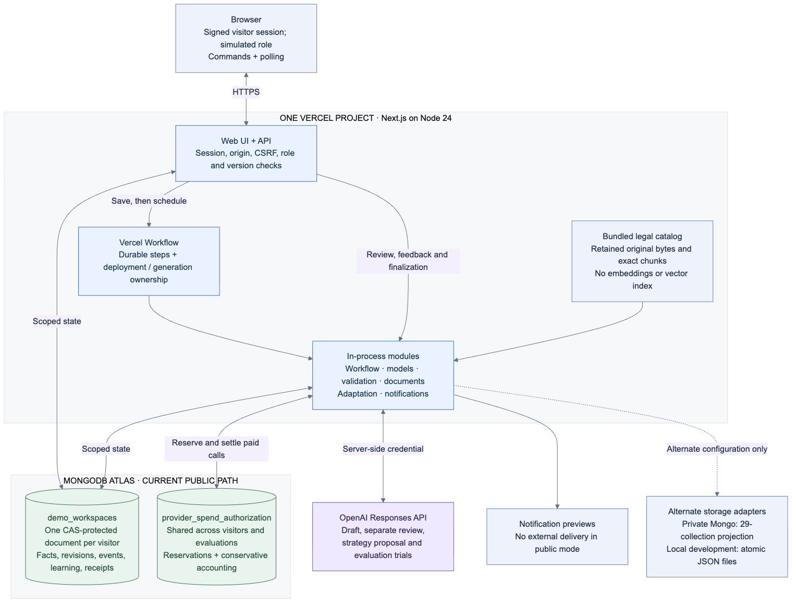

# Kiara: the current architecture

**Implementation snapshot: `74823e4`, deployed to Vercel on 26 September 2026.** This guide describes the code in that snapshot, including its limits. It replaces the pre-implementation overview; the original design is preserved under [history](history/README.md).

**Read this flow first:** a company event starts a durable workflow → the harness pins context → a model uses tools and proposes changes → code and a separate model check them → the founder and lawyer approve the same version → Kiara records the internally finalized document. A separate learning loop can improve the strategy used by later events.

[Open the scalable overview](diagrams/01-system-overview.svg) · [Edit its Mermaid source](diagrams/01-system-overview.mmd) · [All detailed diagrams](diagrams/README.md)

Solid arrows show the main execution and correction paths. Dotted arrows show learning signals, future strategy selection and shared accounting. The boxes are responsibilities, not eight separately deployed services.

## 1. Experience: the company workspace

The React interface is where a person registers an event, inspects the activity timeline, compares policy revisions, enters feedback and approves a document. The right-hand harness panel displays persisted events and provider receipts. It does not expose hidden model reasoning.

The browser sends short API commands and polls saved state. It does not run the model or hold the OpenAI key. In the public demo, the company inputs are fictional and founder/lawyer roles are simulated. **New demo** creates another isolated workspace; it does not erase the previous paid history or reset the shared budget.

**Code:** [KiaraApp](../src/ui/pages/KiaraApp.tsx), [harness UI](../src/ui/components/DemoHarness.tsx), [review controls](../src/ui/components/WorkflowControls.tsx).

## 2. Control: API, state machine and durable worker

The Next.js API checks the signed session, workspace, role, request origin and CSRF protection. State/reset versions reject stale commands. An idempotency key lets the server recognize a repeated command instead of applying it twice. Registering an event first saves `user.signed_up` and a queued workflow, then schedules Vercel Workflow before acknowledging the command. Scheduling can fail after the event is saved; reusing the same command key prevents a duplicate event.

The durable worker advances the application state machine. It acquires the document's review slot, coordinates model calls and pauses foreground processing while people review. Background evaluation work can still proceed. Deployment/generation ownership and leases fence old or duplicate workers. A request already sent to the provider must be accounted for before a superseded worker exits. This is one Next.js/Vercel application with shared modules, not a network of independent microservices.

**Code:** [API route](../src/app/api/%5B...path%5D/route.ts), [authentication](../src/server/auth.ts), [workflow engine](../src/workflow/engine.ts), [durable flow](../src/workflows/process-jobs.ts), [worker ownership](../src/server/worker-ownership.ts).

## 3. Context: what the run is allowed to rely on

Each run pins company facts, the actual prior policy revision, legal-source identities and the selected harness version. A pin fixes the inputs for that run so later changes cannot silently alter what was reviewed. Facts retain whether they are known, unknown or conflicted. A model suggestion does not become a verified fact automatically.

The current legal catalog is a retained, bundled California privacy corpus. Readiness checks require the needed provisions; a deterministic applicability function evaluates the supported California criteria using typed facts. Unsupported jurisdictions, unsupported periods, missing facts or untrusted sources cause a pause or request for information. A missing California policy is not automatically discovered on the internet.

**Retrieval uses exact source passages and literal search. Embeddings and Atlas Vector Search are not implemented.** Public source freshness is a demonstration assumption; private live use requires an attributed lawyer recheck of the registered official-source bytes.

**Code:** [context pins and documents](../src/workflow/documents.ts), [applicability rules](../src/workflow/legal.ts), [bundled fixtures](../src/data/fixtures.ts), [source checks](../src/server/sources.ts).

## 4. Agent execution: retrieve, decide and draft

The drafting model receives pinned inputs, allowed tools and a strict structured-output schema through OpenAI Responses. It can select a tool, consume its result, select another tool and eventually propose clause changes. The server executes each allowed function and returns its output to the model. This is the agent loop.

| Tool | What it does |
| --- | --- |
| `read_company_facts` | Reads selected pinned company facts. |
| `read_policy_clauses` | Reads exact clauses from the prior policy. |
| `read_legal_evidence` / `read_legal_evidence_batch` | Retrieves ranges from registered legal provisions. |
| `find_legal_evidence` | Finds literal text inside a pinned provision. |
| `propose_company_fact` | Records an unverified proposal for founder review. |
| `propose_harness_rule` | Records an advisory strategy suggestion; cannot activate it. |

Legal passages receive citation IDs. The server resolves those IDs to the exact source version, hash and character offsets; the model cannot legitimize an invented passage by supplying a plausible citation. Tool arguments/results and provider response IDs leave receipts. Generated wording, tool choices and repair responses are dynamic. Live mode has no fallback that substitutes a canned successful candidate; scripted local mode is a separate explicit option.

**Code:** [model/tool loop](../src/runtime/index.ts), [evidence and citation adapter](../src/runtime/evidence.ts), [provider configuration](../src/runtime/config.ts).

## 5. Verification: a draft is not yet an approvable document

A structured proposal first passes deterministic checks. Invalid output is retained as failure evidence; a valid candidate is saved as an immutable, unaccepted revision before semantic review, with a redline against the prior document. Both kinds of checks are required:

1. **Deterministic checks:** document structure and hashes, known fact references, exact retrieved citations, required disclosure topics and preservation of unrelated baseline clauses.
2. **Separate model review:** reconstructed policy text, company facts, attributed feedback and full selected authoritative provisions. Complete authority is divided into at most three review batches when needed; every batch must pass. The review uses a protected prompt, but can use the same configured model and provider as drafting.

A repairable failure returns structured feedback to the agent. The finite repair allowance is shared with malformed-tool/proposal recovery; it is not an unlimited recursive loop. Exhausted budgets, unsupported scope and uncertain provider outcomes preserve the evidence and pause. A saved candidate can receive an explicit validation-only retry after an eligible operational failure, provided that workflow's own accounting permits it.

**Code:** [deterministic validator](../src/validation/proposal.ts), [semantic review planner](../src/runtime/semantic.ts), [runtime validation and recovery](../src/runtime/index.ts).

## 6. Human review: two approvals of one exact packet

Passing checks seals a packet containing the candidate, redline, facts, evidence, assessment, feedback, harness version and validation result. The founder approves first. The lawyer then approves the **same packet hash**. Before finalization, the server checks the current document, context, source freshness, integrity and both approvals again. Viewing a document or receiving an email does not count as approval.

Feedback has different effects:

| Human input | Effect on this document |
| --- | --- |
| Company fact correction | Remains proposed until the founder verifies it. Verification advances context and restarts assessment/drafting for active workflows. |
| Direct clause edit | Saves a new immutable revision, invalidates the approval packet and runs validation again. |
| Legal interpretation note | Remains attributed advice, enters model repair and is checked again; it does not become a company fact. |
| Request changes | Invalidates the packet and routes the live workflow back to repair. |
| Approval | Advances the founder/lawyer gate; it does not itself train or promote a strategy. |

When both approvals pass, Kiara advances the internal current policy revision and writes `document.finalized`. This is the final output event. It does not publish a policy to a company website. Operational follow-ups remain separate obligations. The public demo creates email previews, not deliveries.

**Code:** [review, feedback and finalization](../src/workflow/engine.ts), [redlines](../src/workflow/documents.ts), [operational follow-ups](../src/server/review-requirements.ts), [notification outbox](../src/server/notifications.ts).

## 7. Learning: improve later runs without rewriting the guardrails

This is separate from repairing the current document. Eligible failed live validations and attributed human feedback enter a deduplicated improvement queue. Applied human fact corrections are eligible after founder verification. Background improvement work runs when foreground workflow work is absent.

A separate model proposes a strategy using only four prompt modules (`fact_consistency`, `minimal_edits`, `legal_grounding`, `feedback_scope`) and three retrieval orders (`agent_selected`, `facts_first`, `evidence_first`). The evaluator freezes the source/model/evaluator identities and compares baseline and candidate on three cases: the diagnosis case and two unseen synthetic variations. Each strategy runs all three cases through the real generation and checking path: **six provider-backed trials**.

Promotion requires the candidate to pass all three cases, improve pass count or reduce repairs, and stay within a 25% increase in both cost and latency. Provider evidence, accounting, frozen inputs and the current champion version must also match. A failed, incomplete or unchanged comparison keeps the old strategy. An accepted strategy becomes the workspace's new champion; only later events pin it. A rollback preserves history.

Learning is **workspace-local**. It does not update executable code, model weights, legal sources, verified company facts, approval authority, budgets or the validators. The two unseen cases vary synthetic contacts and unrelated clauses; they are not an external legal benchmark. A validation pass or final approval does not automatically rewrite every rule.

There are also wiring limits: free-text `harness_improvement` feedback and verified model-fact receipts are not direct automatic scanner triggers. Advisory model-harness proposals are not directly wired to promotion of that exact suggestion. Blocked campaigns do not have a general automatic resume mechanism.

**Code:** [automatic campaign](../src/adaptation/automatic.ts), [proposal agent](../src/adaptation/proposer.ts), [strategy schema](../src/adaptation/strategy.ts), [campaign and trial accounting](../src/adaptation/automatic.ts).

## 8. Durable foundation: state, evidence and money

The current public deployment stores each visitor's mutable state in one Atlas `demo_workspaces` document. Facts, revisions, workflows, events, feedback, learning and receipts live inside that workspace state. Compare-and-swap on state/reset versions prevents a concurrent write from silently overwriting another. Paid workspaces retain history with `expires_at: null`; visitor session access still expires. Legal source text comes from the bundled retained catalog, rather than a vector index.

A separate operator-wide `provider_spend_authorization` document accounts for **every visitor and evaluation** using that budget database. New demos and workspace resets do not replenish it. The alternate private adapter projects state into 29 collections using MongoDB transactions; local development can use atomic JSON files. Those alternatives are distinct from the public storage path.

| Boundary | Current limit / behavior |
| --- | --- |
| One model run | 24 provider attempts, 16 distinct tool requests, two repairs, 384,000 input and 48,000 output tokens, $3, 240-second absolute deadline. |
| One provider request | Up to 180 seconds, further limited by the remaining run deadline. Review capacity is reserved before drafting/repair. |
| Workspace learning | One campaign at a time, three daily admissions, three adaptation generations; proposal plus six trials can reserve up to $18.25. |
| Shared provider authorization | At most the authorized $50 across visitors and evaluations; two concurrent requests and 20 admissions per minute. |
| Uncertain charge | Keep the reservation/outcome and block dispatch; never silently replay a potentially charged request. |
| Explicit operator reconciliation | May count the full reserved ceiling conservatively, allowing independent work while the original charge remains unknown and its retry remains prohibited. |

Reservations occur before a paid call. Provider usage settles known calls. Conservative accounting is displayed separately from confirmed usage. Vercel Workflow stores routing/ownership metadata; the application keeps document content and evidence in Atlas. The browser reads saved receipts rather than inferring success from a configured key.

**Code:** [storage adapter](../src/data/store.ts), [private physical projections](../src/data/physical.ts), [global spend ledger](../src/server/global-spend.ts), [per-run budget](../src/runtime/budget.ts), [operational evidence](../src/server/operations.ts).

## What is fixed, dynamic, and still unverified

| Category | Current boundary |
| --- | --- |
| Fixed application controls | State transitions, California applicability rules, registered source corpus, disclosure checks, tools, roles, budgets and approval gates. |
| Dynamic agent behavior | Tool selection, generated clause changes and rationale, retrieved citation selection, separate review verdicts, and bounded repair. |
| Bounded learning | Evaluated prompt/retrieval strategies for later events in the same workspace. |
| Demonstration inputs | Fictional company/history overlay, simulated human roles and source-freshness assumption. |
| Outside implemented scope | Embeddings/Atlas Vector Search, autonomous new-jurisdiction ingestion, unrestricted self-modification and public policy publication. |
| Implemented but disabled in the public demo | The Resend delivery adapter and signed-webhook handling exist behind authorization/configuration gates. Public email remains preview-only; live delivery is unverified. |
| Verification status | Real tool calls, draft generation, checks, repairs and evaluation trials are recorded. The latest deployed path through successful live validation, both human approvals and finalization remains unverified in the retained acceptance evidence. A completed six-trial comparison was rejected; no successful learned-strategy promotion is demonstrated. |

**Deployment is not proof of successful acceptance.** This documentation update makes no new provider calls and does not change those verification claims. [Execution evidence](../docs/verification/production-inference.json) and [verification status](../docs/ai-e2e-verification.md) distinguish implemented behavior from observed outcomes.

For engineering detail, use the [diagram index](diagrams/README.md). The original [contracts](contracts.md), [schema design](schema.md), [build plan](build-plan.md) and [demo script](demo.md) remain historical planning artifacts; current runtime code and this guide take precedence for implementation descriptions.
