# Kiara architecture handoff

Kiara helps smaller founders and their lawyers keep legal documents aligned with changes in a business. A signup event starts a source-grounded applicability assessment, a reviewable privacy-policy redline, bounded validation and repair, then founder approval followed by lawyer approval. MongoDB Atlas retains company memory, exact source evidence, document versions, decisions, events, execution records, and the evaluated harness configuration used by later runs.

**Status: integrated architecture candidate; independent final review pending.** This pack designs the complete requested product. Local research and contract checks are recorded separately from future application acceptance. No Kiara app, live model workflow, actual email delivery, public deployment, or measured production improvement has been executed here. The unchanged [original brief](original-brief.md) remains authoritative; only tool self-modification is the user-designated stretch.

The public Rippit site supplies product context, not verified private business facts or existing policy text. The demonstration therefore uses clearly fictional DemoCo facts: an established New York baseline, a declared California-resident signup, prior-year gross revenue of $30 million, and the remaining affirmative coverage and exemption facts explicitly recorded in the [legal fixtures](fixtures/legal/legal-fixtures.json). A California location alone never establishes CCPA coverage. The positive CCPA path, privacy redline, both human gates, current-output repair, and persisted improvement are all retained.

## Selected architecture

One Next.js web/API process authenticates users and accepts short commands. A separate durable Node worker claims persisted jobs; model calls never keep web requests or human review waits open. The worker uses the official OpenAI Responses SDK in a bounded custom tool loop. Deterministic services own authorization, retrieval coverage, budgets, validation, human gates, promotion, and durable commits.

| Layer | Selected implementation |
|---|---|
| Web/UI | Next.js 16.3.6 App Router, React/react-dom 19.3.0, TypeScript, Node 24.19.0 |
| Persistence | MongoDB Atlas, native MongoDB Node driver 7.6.0; 28 physical collections |
| Agent | OpenAI JS 7.23.0, Responses API, `gpt-6-astra` with medium reasoning; fixed tools and immutable run pins |
| Evidence | Tenant-owned retained source bytes and chunks; mandatory exact provision/fact retrieval; lexical search for discovery |
| Documents | Stable clause UUIDs, deterministic clause operations/redline, `diff` 9.0.0 and `canonicalize` 2.1.0 |
| Delivery | Resend 6.30.0 through a durable outbox; separate preview mode and verified delivery callbacks |
| Visibility | Required Atlas-backed activity, evidence, config and performance views; optional sanitized LangSmith 0.10.5 export |
| Build/research chats | Separate persistent `gpt-6-astra` / `xhigh` chats; application model settings are a separate choice |

Exact dependency evidence, access limits and rejected alternatives are in [T06 runtime research](research/T06/report.md), [T10 dependency inventory](research/T10/tool-inventory.md), and the [source ledger](research/T01/source-ledger.json). This design does not introduce an additional agent framework, queue service, vector dependency, or optimizer runtime. All selected API names are documented SDK methods or explicitly defined Kiara operations.

## Behavior and invariants

1. Commit `user.signed_up` once using authenticated tenant scope and an idempotency key. Keep declared legal residence separate from IP, street address and inferred location.
2. Select immutable company facts and legal evidence. A protected readiness check blocks incomplete applicability evidence before assessment or drafting. Unknown facts remain unknown; the assessment returns `covered`, `not_covered`, or `needs_information`.
3. Produce a candidate against an exact base document. Validate structure, coverage, sources, citations, claim support, preservation and hashes. Correct within a shared maximum of two repair actions or persist an escalation.
4. Seal the precise review input and validation result. Founder approval enqueues the assigned lawyer's review request. Lawyer approval of the same current bundle permits finalization. Views, email delivery and informal feedback never count as approval.
5. Persist narrow harness candidates separately from document edits and fact/source updates. Only two reviewed prefetch flags can be automatically promoted after a frozen comparison passes. Later events load the persisted champion after worker restart; existing runs keep their original pin.

Every mutation checks a trusted tenant and reset generation. Material fact/evidence changes and review decisions conditionally write the same tenant guard, preventing stale snapshot approvals. Document slots persist through human waits; worker leases are separate. Approval binds base/candidate content, diff, legal map, facts, evidence, assessment, run/harness, validator configuration, source rechecks and material epochs. A global champion change alone does not invalidate an unchanged historical review bundle.

The foreground ceiling is 9 logical/12 physical model requests, 16 tool calls, 2 total repair actions, 300 seconds, 120,000 input and 24,000 output tokens, and $3 including reserved or unknown charges. These are stopping rules, not measured performance promises. The [runtime policy](contracts/runtime/runtime-policy.json) and [harness plan](harness-and-evals.md) define the phase allocations and evaluation parent budget.

## Build and demonstration

The later five-hour build is a dependency schedule for parallel agents, separate from this research. Thirteen [implementation packets](task-packets/implementation/) cover the full product. The nominal schedule finishes at T+285 with eight active workers plus a coordinator; three workers require T+395, and a 25% common slowdown requires T+356.25. The five-hour outcome is conditional on concurrency, measured latency, ready credentials and the invited Atlas sandbox. Requirements remain in scope when readiness is missing.

The [exact 60-second script](demo.md) shows two labeled failures: a missing applicability bundle before assessment, then a seeded citation-span defect in the proposal. They share the two-action repair budget. Only the former causes the prefetch candidate. The intended measured improvement is **missing-bundle repairs from 1 to 0**, with all other inputs held fixed. The paired result, promotion and later-event proof must actually run before claiming improvement. Full [startup and reset interfaces](run-interface.md) keep preview, scripted actions and real execution visibly distinct.

## Pack navigation

| Artifact | Purpose |
|---|---|
| [Diagrams](diagrams/README.md) | System overview, event/approval sequence, workflow, physical schema and harness adaptation |
| [Schema](schema.md) · [validators/indexes](schema/) · [fixtures](fixtures/README.md) | Physical boundaries, writer permissions, concurrency and parseable examples |
| [Contracts](contracts.md) · [operation registry](contracts/operation-registry.json) | Components, typed request/result/errors, events, transitions and retry ownership |
| [Harness and evaluations](harness-and-evals.md) | Current repair, finite patch, protected rules, frozen comparison, promotion and rollback |
| [Build plan](build-plan.md) · [demo](demo.md) | Agent dependencies, elapsed schedule, prerequisites, script and submission owners |
| [Traceability](traceability.md) | All 130 preserved requirements through artifacts, diagrams, owners, packages and checks |
| [Review](review.md) | Independent findings, corrections, recheck and actual validation limits |
| [Research](research/) · [thread registry](thread-registry.json) | Seventeen real specialist chats and source-grounded handoffs |

The organizer's precise cutoff, invited sandbox access/eligibility, provider credentials, actual email transmission, on-site recording/attendance and public release remain explicit implementation or human readiness gates. No private invitation or credit form was accessed or submitted, and no external publication is implied by this handoff.
